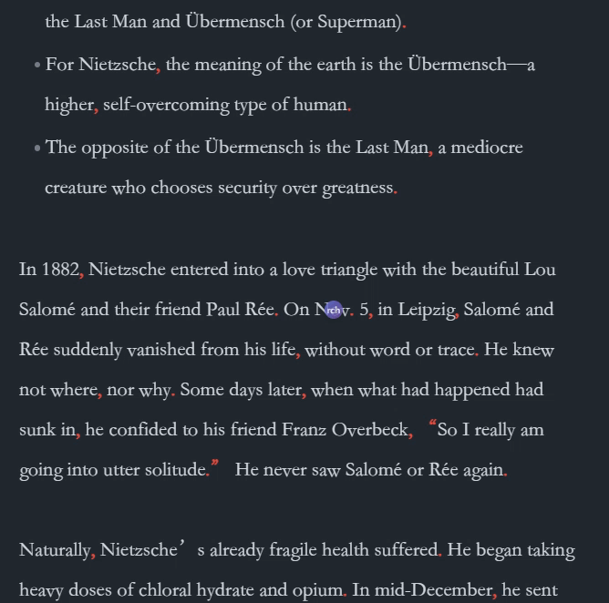
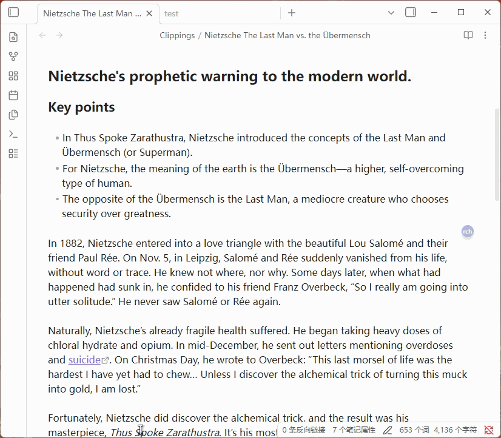
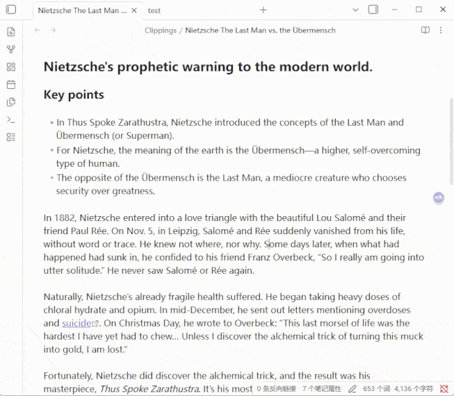

[中文](#Regex-CSS-Highlighter-zh) | English

---

#Regex-CSS-Highlighter-en
---
An Obsidian plugin that matches text via regular expressions and applies custom CSS styles for highlighting.

## Add Style

.gif)

.gif)

## Features

### 🎨 Style Highlighting

Style Highlighting

- Regex Matching + CSS Styles — Match text using regular expressions and apply custom CSS styles to matched content
- Style Category Management — Styles organized by groups, with support for adding, editing, and deleting
- Instant Style Application — Styles take effect immediately after adding/editing/deleting, no restart required
- Floating Style Buttons — Right-click a style button to create a draggable floating button with adjustable size and opacity
- Style Button Context Menu — Copy class name, copy full style, float display, and other quick actions

### 📝 Rule Management

Rule Management

- Current File / Global Rules — Support for both file-level and global rule scopes
- Rule Source Markers — Hover over matched text to see rule source (g=global/l=local), click to jump to the rule
- Highlight List — View all matched highlight rules in the current file, with per-column search and filtering
- Clipboard Merge — Merge clipboard content with selected text to add as a highlight rule

### 🔮 Floating Ball / Button

Floating Ball / Button

- Quick Access — Floating ball provides quick style application: left-click for current file rules, middle-click for global rules
- Group Submenu — Hover over a group option to expand a submenu showing all styles in that group
- Floating Option Buttons — Menu options can be pinned as independent floating buttons for instant access
- Show/Hide Text Styles — One-click toggle to show or hide all text style highlights

### 📱 Mobile Adaptation

Mobile Adaptation

- Touch Dragging — Floating ball and floating buttons support touch dragging for position adjustment
- Mobile Layout Settings — Line height and margins for mobile reading mode, independent from desktop
- Panel Opacity — Adjustable opacity for main panel and button panels on mobile
- Collapsible Filters — Highlight list filter panel collapsed by default on mobile to save screen space

### ✏️ Typography & Fonts

Typography & Fonts

- System Font Switching — Direct access to installed system fonts, no font files needed
- Font Favorites — Star favorite fonts to pin them to the top for quick access
- Line Height & Margins — Support for line height, left margin, and right margin settings, working in both edit and reading mode
- Scroll Wheel Adjustment — Numeric input fields support mouse wheel for quick value adjustment

### 📌 Notes

Notes

- Text Notes — Add notes to highlighted text with Markdown rendering support
- Image Support — Note popup supports uploading images and pasting from clipboard
- Table Rendering — Notes support Markdown tables with borders and zebra striping

### 🤖 AI Integration

AI Integration

- Multiple AI Configs — Support for multiple AI services (OpenAI, DeepSeek, etc.) with custom API endpoints and models
- AI Entity Extraction — Automatically identify entities in text using AI and batch add highlight rules

## Share Your CSS Styles

Created a cool style? Share it with the community in [Discussions](https://github.com/dlsdgj/obsidian-regex-css-highlighter/discussions/1) — see how others use regex and CSS to highlight their notes!

## Installation

Search for "Regex Css Highlighter" in Obsidian Settings → Community Plugins → Browse to install directly.

Manual Installation

1. Download `main.js` and `manifest.json`
2. Create a `Regex-Css-Highlighter` folder in your Obsidian vault's `.obsidian/plugins/` directory
3. Place the downloaded files in that folder
4. Enable "Regex Css Highlighter" in Obsidian Settings → Community Plugins

## Changelog

Changelog

v1.6.5 (2026-06-03)

- **Pseudo-element Style Support** — Add Style dialog now correctly previews and saves CSS rules with pseudo-elements (::before, ::after); pseudo-element rules are associated with their parent class
- **@keyframes Animation Support** — Add Style dialog now correctly previews and saves CSS rules with @keyframes animations; animation rules are placed below the main style rules; @keyframes blocks are stripped before class parsing to prevent false matches from decimal values inside keyframe definitions
- **Remove Highlight Regex Matching Fix** — Fixed bug where rules containing regex escape characters (e.g. `\\.`) could not be matched when removing highlights by selecting text; replaced direct string comparison with regex matching via `textMatchesRegex()` helper function
- **Remove Preview Checkboxes** — Removed checkboxes from style preview in Add Style dialog; clicking "Add Style" now adds all parsed styles by default
- **README Add Style Demo** — Added "Add Style" and "AI Create Style" demo GIFs to README in both English and Chinese sections

v1.6.4 (2026-06-03)

- **Main Panel Group Button Style Customization** — Added right-click context menu option to edit group button style class; supports custom CSS class preview and application
- **Dark Mode Title Text Visibility Fix** — Removed custom text colors from panel titles, style list/group labels, and settings text; now uses default theme colors for proper dark mode support
- **Pin Submenu Button Repositioned** — Moved "Pin Submenu" button to top-left corner of submenus to avoid blocking style buttons
- **Submenu Direction Adaptation** — Floating group submenus now open to the left when the group is on the right side of the screen, preventing overlap with group buttons on mobile
- **Mobile Horizontal Scroll Fix** — Mobile now limits modal width to screen width even when desktop saved a larger modalWidth value; prevents horizontal overflow caused by cross-device settings sync

v1.6.3 (2026-06-02)

- **Fixed Callout Highlight Not Showing in Edit Mode** — Added `applyHighlightsToLivePreviewCallouts` method to apply DOM-based highlighting to callout widgets in live preview mode; ViewPlugin's update now schedules callout highlight via debounced `requestAnimationFrame`; scroll and layout-change events also trigger callout highlighting in source mode
- **Fixed Overlapping Decoration Ranges** — Improved range sorting with secondary `to` key; added validation filter for invalid ranges; switched to `Decoration.set(validRanges, true)` to enable CodeMirror's internal sorting for safer handling of overlapping decorations from multiple rules
- **Added Remark Demo GIF** — Added `addremark.gif` to assets folder and referenced it in both English and Chinese Notes/备注功能 sections of README.md

v1.6.2 (2026-06-02)

- **Custom Default Preview Text** - Added "Default Preview Text" setting in Display section with separate Chinese/English input fields; when no text is selected, style buttons show custom text instead of default "示例"/"Preview"
- **Fixed Clickable Title Text for Rules Sections** - Clicking "Current File Rules" and "Global Rules" title text now correctly triggers expand/collapse; added pointer-events:none to h3 and description elements to ensure click events bubble properly
- **Highlight List Search No Data Fix** - When column filters match no results, table header with search inputs is now preserved instead of being cleared; "No data" message appears in tbody while search remains functional
- **Visible Column Resizer** - Column resize handles in highlight list are now always visible with a subtle border color; hover highlights in accent color
- **Fixed Column Resize Affecting Other Columns** - Dragging a column resizer now only adjusts the current column and its right neighbor (one grows, one shrinks); other columns remain unaffected
- **Smooth Column Resizing** - Cached table width on mousedown instead of reading DOM on every mousemove; eliminated layout thrashing for smooth drag experience
- **Highlight List Performance Optimization** - Used DocumentFragment for batch DOM construction; replaced per-row event listeners with event delegation on tbody; eliminated duplicate filter computation in stats display

v1.6.1 (2026-06-02)

- **Remark Badge Indicator** - Added "Show remark indicator at top-right of highlighted text" setting under Remark Popup section; hovering highlighted text shows a small "n" badge, clicking it opens the Add Remark modal; includes character threshold option
- **Long Phrase Priority Matching** - When merging rules (e.g. "视角主义" + "视角主义真理观"), longer phrases now match first; added sortRegexByLength utility function applied to all regex matching logic
- **Fixed Remark Popup in Edit Mode Callouts** - Remark popup now works correctly in CodeMirror edit mode for text inside callouts; changed from classList.contains to closest() for upward DOM traversal
- **Remark Popup Setting Name Fix** - Renamed "确认后不自动关闭" to "鼠标离开不自动关闭"; remark popup now auto-closes after clicking confirm
- **Global Highlight Rules Scrollbar** - Added scrollbar to global highlight rules section when content exceeds viewport height
- **Hide Open File Links Setting** - Added "Don't show open file links after panel titles" setting in Display section; controls visibility of "Open styles.css", "Open group file", "Open data.json" links
- **Localized Default Group Name** - Default group name for new styles now follows plugin language (e.g. "New Group" in English mode)
- **Floating Element Initial Position** - First-time hover on options/groups/style buttons now positions near the mouse cursor
- **Language Switch Instant Refresh** - Switching language now immediately refreshes the panel without needing to reopen
- **Fixed Arrow Position After Style Edit** - Arrow indicator now stays inside the group style area after editing custom styles
- **Floating Group Button Positioning** - Each floating group button appears near the mouse cursor with top-right corner aligned to mouse position; position info cleared on close
- **Full-Width Clickable Panel Titles** - "Settings", "Current File Rules", "Global Rules" titles now have full-width clickable area and background shading for expand/collapse

v1.6.0 (2026-06-01)

- **Floating Group No Longer Auto-Added to Floating Ball Menu** - Floating a group via main panel group title hover button or right-click "Float This Group" now only creates floating buttons without automatically adding the group to the floating ball menu; users can manually add groups in the floating ball menu settings

v1.5.9 (2026-06-01)

- **Default Language Changed to English** - New installations now default to English; Chinese users can switch via CN/EN button
- **Floating Ball Options Simplified** - Format Replace, Ruby, AI Reply, Entity Extract, Font Switch, Mode Switch, Hide Floating Buttons, Show/Hide Text Styles are unchecked by default for new installations
- **Heading Styles Disabled by Default** - New installations have heading styles disabled to reduce visual clutter
- **Floating Ball Menu Position Fix** - Menu now appears on the left side when floating ball is on the right half of the screen, avoiding overlap
- **English Menu Text Wrapping Fix** - Increased menu width and added nowrap to prevent English option text from wrapping to two lines
- **Plugin Market Support** - Added versions.json for Obsidian plugin market compatibility; install directly by searching "Regex Css Highlighter"
- **README Updated** - Added demo GIFs, plugin market install instructions, removed keyboard shortcuts section, manual install moved to collapsible section
- **Changelog Migrated to CHANGELOG.md** - Version history moved from README.md to standalone CHANGELOG.md file

v1.5.8 (2026-06-01)

- **Removed "About" Section** - Removed "About" section from bottom of main panel; version changelog migrated to CHANGELOG.md
- **Cleaned Up Donation Code** - Removed showDonateImage class methods and standalone functions, setupDonateText function, donation button CSS styles, and related translation keys
- **Cleaned Up Unused Translation Keys** - Removed main.tab.about, settings.about, settings.updateHistory, settings.viewUpdates and other unused translation keys
- **Removed DONATE_QR_CODE Constant** - Removed base64-encoded donation QR code image constant

v1.5.7 (2026-05-31)

- **Internationalization Support** - Added CN/EN language switch button in main panel, supports switching between Chinese and English interfaces
- **Full i18n Coverage** - All UI text including settings titles, floating ball options, and group style buttons fully internationalized
- **"Show/Hide Text Styles" in Floating Ball Management** - Added option to control whether this feature appears in floating ball menu
- **Fixed Auto-Scroll on Middle-Click in Group Submenu** - Middle-click to add global rules no longer triggers auto-scroll state
- **Style Name Column in Highlight List** - Added style name column to highlight list; display text shown on separate line when present; toggleable visibility
- **Per-Column Header Search** - Added search box to each table header with placeholder showing header text, supports real-time per-column filtering
- **Removed "Add to Highlight List" Feature** - Removed style button right-click "Add to Highlight List" option and highlight list filters: show style name, by style name
- **Min Count Always Visible** - Removed mode dropdown; min count input always visible; Chinese label changed to "样式最少被应用 [X] 次"

v1.5.6 (2026-05-31)

- **Floating Submenu Right-Click Options** - Added "Modify Display Text", "Copy Class Name", "Copy Full Style" options to floating group submenu style right-click menu
- **Submenu Right-Click UX Fix** - Fixed issue where submenu would hide when mouse moved to right-click menu options
- **Middle-Click for Global Rules** - Middle-click on floating group submenu style adds selected text as global rule
- **Rule Source Markers (g/l)** - Hover over matched rule text to show global/local marker "g/l", click to jump to corresponding rule; supports character count threshold setting
- **Edit Mode Marker Fix** - Fixed bug where "g/l" markers were added as text content in edit mode
- **Floating Submenu Class Name Hint** - Hover over floating group submenu style items to display class name hint
- **Text Style Show/Hide** - Added "Show Text Styles"/"Hide Text Styles" options to floating ball hover menu; hides all text style matches when hidden

v1.5.5 (2026-05-29)

- **Hidden Position Data Preservation** - Saves position data when hiding floating style buttons; automatically restores to original position on next show
- **Floating Display Button in Main Panel** - Added 📌 button that appears on hover over style buttons in main panel; click to float display that style

v1.5.4 (2026-05-28)

- **Clean Up Non-Existent Styles** - Added "Clean Up Non-Existent Styles in Category Files" feature under Settings → Display; scans and removes styles present in style-categories.json but missing from styles.css
- **Scrollbar for Group Submenus** - Added scrollbars to floating ball menu and floating option button group style submenus; prevents overflow when many styles exist
- **Light Blue Background for Settings Headers** - Added light blue background to all level headers in main panel settings for better visual hierarchy

v1.5.3 (2026-05-27)

- **Mobile Reading Mode Line Height** - Added line height setting in mobile "Display" settings; merged with margin settings into "Mobile Reading Mode Line/Margin"
- **Mobile Panel Opacity** - Added main panel and button panel opacity settings in mobile "Display" settings
- **Mobile Typography Settings Separated** - Mobile no longer applies desktop line height and margin settings; controlled by mobile-specific settings
- **Mobile Auto-Expand Fix** - Fixed bug where first style was incorrectly applied to text when group expanded in mobile auto-expand mode
- **Header Settings Category** - Moved "Header Level Tags" and "Disable Header Styles" to newly created "Headers" settings category
- **Count Info Fix** - Fixed bug where "Style Categories" and "Count Files" count info not displayed on same line; removed link styling
- **Floating Ball Menu Opacity** - Floating ball menu supports Ctrl+scroll to adjust opacity; preserved after restart
- **Right-Click Menu Improvements** - Auto-closes previous menu when right-clicking another style; added "Move to Group" option in normal mode right-click menu

v1.5.2 (2026-05-26)

- **Settings Outline Reorganization** - Changed settings from flat separator line format to outline-style indentation with collapse/expand, better visual hierarchy
- **Show Recent Rules When Collapsed** - Added setting to control whether to show recently added rules when main panel opened with no text selected and highlight rules collapsed
- **Hide Font Switch on Mobile** - Hidden font switching feature area on mobile devices
- **Hide Open File Link on Mobile** - Hidden open data.json file link next to "Settings" header on mobile

v1.5.1 (2026-05-25)

- **Typography Settings** - Added line height, left margin, and right margin settings in "Switch Body Font" popup; works in both edit and reading mode
- **Scroll Wheel Value Adjustment** - Line height and margin input fields support mouse wheel for quick value adjustment
- **Edit Mode Margin Fix** - Fixed issue where left/right margins not working in edit mode

v1.5.0 (2026-05-25)

- **Disable Header Styles** - Added "Disable Header Styles" toggle in settings; when disabled, custom header styles not applied but header level tags preserved; "Header Styles" area hidden in main panel when disabled
- **Level Tags Compatible with Gradient Text** - Fixed issue where level tags invisible when using gradient text CSS snippet; reset inherited transparent text and background-clip properties in pseudo-element
- **Removed Usage Instructions** - Removed "Usage Instructions" content from main panel for cleaner UI

v1.4.9 (2026-05-25)

- **Instant Style Application** - Fixed issue where adding/editing/deleting styles required Obsidian restart to display; new styles now take effect immediately
- **Style Refresh Mechanism Optimized** - Removed destructive forceStyleRefresh call to avoid clearing newly injected CSS; directly update dynamic style elements after writing CSS file, no re-read needed
- **CSS Read/Write Consistency Fix** - Changed injectCSSContent to use vault.adapter.read for consistency with write API, avoiding cache desynchronization
- **Modal Refresh Acceleration** - Removed multi-layer setTimeout delays (500ms+200ms) after adding styles; popup refreshes instantly
- **Delete Style Instant Refresh** - Removed 1-second delay after deleting styles; immediately re-inject CSS and refresh view

v1.4.7 (2026-05-24)

- **System Font Switching** - Font switching now directly reads installed system fonts, no font files needed; eliminates CSP/OTS compatibility issues
- **Font Favorites Feature** - Font list supports starring to favorite; favorited fonts pinned to top for easy access
- **Font Search** - Added search box to font selection popup for quick font filtering and positioning
- **Font List Styling** - Card-style layout, SVG star icons, "In Use" label, hover interaction optimizations

v1.4.6 (2026-05-22)

- **DeepSeek Default Config Update** - For new plugin installations, DeepSeek default base_url changed to https://api.deepseek.com/chat/completions, model changed to deepseek-v4-flash
- **Style Class Name Hint** - Added hint to style class name input field in edit floating option window: "Long-press/right-click main panel style button → Copy Class Name"

v1.4.5 (2026-05-22)

- **Floating Ball Remove Highlight** - Added "Remove Highlight" option to floating ball; click after selecting highlighted text to remove corresponding rule; supports intelligent multi-part rule splitting
- **Rule Right-Click Menu Enhanced** - Current file rule and global rule buttons right-click menu added "Delete Rule" and "Move to Global/Current File Rule" options
- **Reading Mode Selected Text Fix** - Fixed issue where selecting text in reading mode then opening main panel couldn't get selected text; save selection before modal opens
- **Floating Option Arrow Fix** - Fixed issue with two arrows appearing on floating option button after editing style; arrow moved inside style area to save space
- **Mobile Main Panel Optimization** - Hidden opacity/width controls and title hint message/link on mobile; regular expression label displayed on separate line
- **Removed Add Note Button** - Removed "Add Note" button from main panel; note feature still accessible via right-click menu and floating ball

v1.4.4 (2026-05-22)

- **Floating Button Zoom Offset Fix** - Fixed bug where floating style button would move left/right when clicked after Alt+scroll zoom adjustment
- **About Panel Height Fix** - Changed "About" section height from fixed 300px to 70vh adaptive to window height
- **Copy Class Name Feature** - Added "Copy Class Name" option to style button right-click menu; one-click copy CSS class name to clipboard

v1.4.3 (2026-05-22)

- **Reading Mode Cross-Element Highlighting** - Rewrote highlight matching logic to support matching long text across DOM element boundaries; solves issue where text with existing highlights or global rule modifiers couldn't apply new styles in reading mode
- **Right-Click Menu Overflow Fix** - Floating option button and floating style button right-click menus automatically adjust position when at screen right/bottom edges; no longer overflow screen

v1.4.2 (2026-05-21)

- **Mobile Floating Style Button Dragging** - Fixed issue where restored floating style buttons couldn't be dragged to adjust position on mobile
- **Touch Drag Anti-Misoperation** - Floating style button touch drag no longer accidentally triggers style application

v1.4.1 (2026-05-21)

- **Floating Option Right-Click Menu** - Changed floating option button right-click to popup menu (Edit/Close); no longer closes directly
- **Floating Option Edit Feature** - Right-click "Edit" allows modifying display text and style class name; style class name supports full pseudo-element rendering
- **Floating Option Scroll Wheel Adjustment** - Alt+scroll adjusts size, Ctrl+scroll adjusts opacity; preserved after restart
- **Floating Style Button Edit Name** - Added "Edit Name" option to floating style button right-click menu; allows modifying display text
- **Style Class Name Rendering Optimization** - Removed default border frame after setting style class name; fully injects CSS rules including pseudo-elements; supports complex styles

v1.4.0 (2026-05-21)

- **Mobile Floating Ball Adaptation** - Increased floating ball size to 36px, adjusted default position, added position safety check to ensure visibility
- **Mobile Floating Ball Menu** - Clicking floating ball pops up option menu instead of direct highlighting; differentiated from desktop behavior
- **Mobile Floating Button Dragging** - Added touch event support to floating style buttons and floating option buttons; draggable to adjust position
- **Mobile Reading Mode Line/Margin** - Added mobile reading mode line height and left/right margin settings; moved to "Display" category; separated from desktop typography settings
- **Mobile Collapsible Filter Panel** - Changed highlight list filter area to collapsible panel; collapsed by default, click to expand
- **Mobile List-Style Highlight Display** - Changed highlight list to card-style layout on mobile; notes collapsed into highlight text, click to expand
- **Highlight List Performance Optimization** - Parallelized file reading, memory cache priority, eliminated redundant exists calls, global rule Map indexing
- **Loading State Indicator** - Shows "Loading..." indicator when highlight list opens and when filter switches; renders UI first then loads data

v1.3.9 (2026-05-20)

- **Mobile Compatibility** - Encapsulated cross-platform file operation utility class; desktop uses Node.js fs module (high performance), mobile uses Vault Adapter (compatibility)
- **Reading Mode Scroll Highlighting** - Fixed issue where highlights lost after scrolling; added scroll event listener to automatically re-apply highlights in viewport
- **Delay Handling Race Condition Fix** - Fixed timer race condition in PostProcessor delayed batch processing

v1.3.8 (2026-05-14)

- **Reading Mode Highlight Fix** - Fixed issue where some matched text didn't display styles in reading mode; recursively processes text nodes in nested inline elements
- **Floating Button Border Following** - Floating option buttons and floating style buttons use right positioning when at screen right edge; automatically follow movement when window border dragged
- **Disabled Rule Filtering** - Automatically filters out disabled rules during highlight processing to avoid invalid matches

v1.3.7 (2026-05-13)

- **Image Support in Notes** - Note popup supports uploading images and pasting from clipboard; images automatically saved to attachments directory
- **Table Support in Notes** - Note popup supports Markdown table rendering with borders, header highlighting, and zebra striping
- **Right-Click Menu** - Added "Close Floating Display" option to floating button right-click menu

---

中文 | [English](#Regex-CSS-Highlighter-en)

---

#Regex-CSS-Highlighter-zh
---
一个 Obsidian 插件，通过正则表达式匹配文本并应用自定义 CSS 样式高亮显示。

## 添加样式

.gif)

.gif)

## 功能特性

### 🎨 样式高亮

样式高亮

- 正则匹配 + CSS 样式 — 使用正则表达式匹配文本，为匹配内容应用自定义 CSS 样式
- 样式分类管理 — 样式按分组分类，支持添加、编辑、删除样式
- 样式即时生效 — 添加/编辑/删除样式后无需重启，立即在笔记中生效
- 样式悬浮按钮 — 右键样式按钮可创建可拖动的悬浮按钮，支持调整大小和透明度
- 样式按钮右键菜单 — 复制类名、复制完整样式、悬浮显示等快捷操作

### 📝 规则管理

规则管理

- 当前文件规则 / 全局规则 — 支持文件级和全局级两种规则范围
- 规则来源标记 — 鼠标悬停匹配文本时显示规则来源（g=全局/l=局部），点击可跳转
- 高亮列表 — 查看当前文件中所有匹配的高亮规则，支持按列搜索、筛选
- 合并剪贴板 — 将剪贴板内容与选中文本合并添加为高亮规则

### 🔮 悬浮球

悬浮球

- 快速访问 — 悬浮球提供样式快速应用入口，左键应用当前文件规则，中键应用全局规则
- 分组子菜单 — 悬停分组选项展开子菜单，显示该分组所有样式
- 悬浮选项按钮 — 菜单选项可创建独立的悬浮按钮，随时可用
- 显示/隐藏文本样式 — 一键切换所有文本样式的显示与隐藏

### 📱 移动端适配

移动端适配

- 触摸拖动 — 悬浮球和悬浮按钮支持触摸拖动调整位置
- 独立排版设置 — 手机版阅读模式行距、边距独立于桌面版设置
- 面板透明度 — 手机版主面板和按钮面板支持透明度调整
- 折叠式筛选 — 高亮列表筛选区域默认收起，节省屏幕空间

### ✏️ 排版与字体

排版与字体

- 系统字体切换 — 直接读取系统已安装字体，无需放入字体文件
- 字体收藏 — 星标收藏常用字体，收藏字体置顶显示
- 行间距与边距 — 支持行间距、左边距、右边距设置，编辑和阅读模式均生效
- 滚轮微调 — 数值输入框支持鼠标滚轮快速调整

### 📌 备注功能

备注功能

- 文本备注 — 为高亮文本添加备注，支持 Markdown 渲染
- 图片支持 — 备注弹窗支持上传图片和粘贴剪贴板图片
- 表格渲染 — 备注支持 Markdown 表格，带边框和斑马纹样式

### 🤖 AI 集成

AI 集成

- 多 AI 配置 — 支持配置多个 AI 服务（OpenAI、DeepSeek 等），自定义 API 地址和模型
- AI 实体提取 — 使用 AI 自动识别文本中的实体并批量添加高亮规则

## 分享你的 CSS 样式

创建了好看的样式？在 [Discussions](https://github.com/dlsdgj/obsidian-regex-css-highlighter/discussions/1) 中与社区分享——看看其他人如何用正则和 CSS 高亮他们的笔记！

## 安装

在 Obsidian 设置 → 社区插件 → 浏览 中搜索 "Regex Css Highlighter" 直接安装。

手动安装

1. 下载 `main.js`、`manifest.json`
2. 在 Obsidian 库的 `.obsidian/plugins/` 目录下创建 `Regex-Css-Highlighter` 文件夹
3. 将下载的文件放入该文件夹
4. 在 Obsidian 设置 → 社区插件中启用 "Regex Css Highlighter"

## 更新日志

更新日志

v1.6.5 (2026-06-03)

- **伪元素样式支持** — 添加样式窗口正确预览和保存含伪元素(::before, ::after)的CSS规则，伪元素规则关联到主类
- **@keyframes 动画支持** — 添加样式窗口正确预览和保存含 @keyframes 动画的CSS规则，动画规则放在样式规则下方；解析前移除 @keyframes 块避免内部小数被误匹配为类选择器
- **移除高亮正则匹配修复** — 修复含正则转义字符(如 `\\.`)的规则无法通过选中文本移除高亮的问题，改用 `textMatchesRegex()` 辅助函数进行正则匹配
- **移除预览复选框** — 添加样式窗口移除预览前的复选框，点击"添加样式"默认添加全部解析到的样式
- **README 添加样式演示** — 在 README 中英文部分新增"添加样式"和"AI创建样式"演示 GIF

v1.6.4 (2026-06-03)

- **主面板分组按钮样式自定义** — 右键菜单添加"修改分组样式"选项，可自定义分组按钮的CSS样式类，支持预览和应用
- **深色模式标题文字可见性修复** — 移除主面板标题、样式列表/分组、设置等文字的自定义颜色，使用默认主题色，确保深色模式正常显示
- **"固定子菜单"按钮位置调整** — 移动到子菜单左上角，避免遮挡样式按钮
- **子菜单方向适配** — 悬浮分组在右侧时子菜单向左展开，避免覆盖分组按钮
- **手机端横向滚动修复** — 手机端限制modalWidth不超过屏幕宽度，解决桌面端保存的大宽度值导致手机端溢出

v1.6.3 (2026-06-02)

- **修复编辑模式Callout高亮不显示** — 添加 `applyHighlightsToLivePreviewCallouts` 方法，对实时预览中的callout组件应用DOM高亮；ViewPlugin更新时通过防抖 `requestAnimationFrame` 调度callout高亮；滚动和布局变化事件也会触发callout高亮
- **修复装饰范围重叠** — 改进范围排序，增加 `to` 作为次要排序键；添加无效范围过滤；使用 `Decoration.set(validRanges, true)` 启用CodeMirror内部排序，更安全地处理多规则重叠装饰
- **添加备注演示GIF** — 在assets文件夹添加 `addremark.gif`，并在README中英文备注功能部分引用

v1.6.2 (2026-06-02)

- **自定义默认预览文本** — 在显示设置中添加"默认预览文本"设置，支持中英文分别输入；未选中文本时样式按钮显示自定义文本
- **修复规则标题文字点击问题** — 点击"当前文件规则"和"全局规则"标题文字现在正确触发展开/折叠；添加pointer-events:none确保点击事件正确冒泡
- **高亮列表搜索无数据修复** — 列筛选无结果时保留表头搜索框，"无数据"提示显示在tbody中，搜索功能仍可用
- **列调整手柄可见** — 高亮列表列调整手柄始终可见，悬停时高亮显示
- **修复列调整影响其他列** — 拖动列调整手柄只调整当前列和右侧相邻列，其他列不受影响
- **流畅列调整** — mousedown时缓存表格宽度，避免每次mousemove读取DOM，消除布局抖动
- **高亮列表性能优化** — 使用DocumentFragment批量构建DOM；事件委托替代逐行监听；消除重复筛选计算

v1.6.1 (2026-06-02)

- **备注标记指示器** — 在备注弹窗设置中添加"在高亮文本右上角显示备注指示器"；悬停高亮文本显示小"n"标记，点击打开添加备注弹窗；支持字数阈值选项
- **长词组优先匹配** — 合并规则时（如"视角主义"+"视角主义真理观"），更长的词组优先匹配；添加sortRegexByLength工具函数应用于所有正则匹配逻辑
- **修复编辑模式Callout中备注弹窗** — 备注弹窗在CodeMirror编辑模式中正确处理callout内文本；改用closest()向上遍历DOM
- **备注弹窗设置名称修复** — "确认后不自动关闭"改为"鼠标离开不自动关闭"；点击确认后自动关闭备注弹窗
- **全局高亮规则滚动条** — 全局高亮规则区域内容超出视口高度时添加滚动条
- **隐藏打开文件链接设置** — 在显示设置中添加"不显示标题后面的打开文件链接"；控制"打开styles.css"、"打开分组文件"、"打开data.json"链接的可见性
- **本地化默认分组名称** — 新样式的默认分组名称跟随插件语言（如英文模式下为"New Group"）
- **悬浮元素初始位置** — 首次悬停选项/分组/样式按钮时在鼠标附近定位
- **语言切换即时刷新** — 切换语言后立即刷新面板，无需重新打开
- **修复样式编辑后箭头位置** — 编辑自定义样式后箭头指示器保持在分组样式区域内
- **悬浮分组按钮定位** — 每个悬浮分组按钮在鼠标附近出现，右上角对齐鼠标位置；关闭时清除位置信息
- **全宽可点击面板标题** — "设置"、"当前文件规则"、"全局规则"标题具有全宽可点击区域和背景着色

v1.6.0 (2026-06-01)

- **悬浮分组不再自动添加到悬浮球菜单** — 通过主面板分组标题悬停按钮或右键"悬浮此分组"创建悬浮按钮时，不再自动将分组添加到悬浮球菜单；用户可在悬浮球菜单设置中手动添加

v1.5.9 (2026-06-01)

- **默认语言改为英文** — 新安装默认使用英文；中文用户可通过CN/EN按钮切换
- **悬浮球选项简化** — 格式替换、注音、AI回复、实体提取、字体切换、模式切换、隐藏悬浮按钮、显示/隐藏文本样式在新安装中默认不勾选
- **标题样式默认禁用** — 新安装默认禁用标题样式以减少视觉杂乱
- **悬浮球菜单位置修复** — 悬浮球在屏幕右半部分时菜单出现在左侧，避免重叠
- **英文菜单文字换行修复** — 增加菜单宽度并添加nowrap，防止英文选项文字换行
- **插件市场支持** — 添加versions.json以兼容Obsidian插件市场；直接搜索"Regex Css Highlighter"安装
- **README更新** — 添加演示GIF、插件市场安装说明，移除快捷键部分，手动安装移至折叠区域
- **更新日志迁移至CHANGELOG.md** — 版本历史从README.md迁移到独立的CHANGELOG.md文件

v1.5.8 (2026-06-01)

- **移除"关于"部分** — 从主面板底部移除"关于"部分；版本更新日志迁移至CHANGELOG.md
- **清理捐赠代码** — 移除showDonateImage类方法和独立函数、setupDonateText函数、捐赠按钮CSS样式及相关翻译键
- **清理未使用的翻译键** — 移除main.tab.about、settings.about、settings.updateHistory、settings.viewUpdates等未使用的翻译键
- **移除DONATE_QR_CODE常量** — 移除base64编码的捐赠二维码图片常量

v1.5.7 (2026-05-31)

- **国际化支持** — 在主面板添加CN/EN语言切换按钮，支持中英文界面切换
- **完整i18n覆盖** — 所有UI文本包括设置标题、悬浮球选项、分组样式按钮完全国际化
- **"显示/隐藏文本样式"悬浮球管理** — 添加选项控制此功能是否出现在悬浮球菜单中
- **修复分组子菜单中键自动滚动** — 中键添加全局规则不再触发自动滚动状态
- **高亮列表样式名称列** — 高亮列表添加样式名称列；存在显示文本时单独一行显示；可切换可见性
- **按列标题搜索** — 每个表头添加搜索框，占位符显示表头文本，支持实时按列筛选
- **移除"添加到高亮列表"功能** — 移除样式按钮右键"添加到高亮列表"选项和高亮列表筛选器：显示样式名称、按样式名称筛选
- **最少次数始终可见** — 移除模式下拉框；最少次数输入框始终可见；中文标签改为"样式最少被应用 [X] 次"

v1.5.6 (2026-05-31)

- **悬浮子菜单右键选项** — 悬浮分组子菜单样式右键菜单添加"修改显示文本"、"复制类名"、"复制完整样式"选项
- **子菜单右键交互修复** — 修复鼠标移动到右键菜单选项时子菜单会隐藏的问题
- **中键添加全局规则** — 悬浮分组子菜单样式中键点击将选中文本添加为全局规则
- **规则来源标记(g/l)** — 悬停匹配规则文本显示全局/局部标记"g/l"，点击跳转到对应规则；支持字数阈值设置
- **编辑模式标记修复** — 修复编辑模式中"g/l"标记被添加为文本内容的bug
- **悬浮子菜单类名提示** — 悬停悬浮分组子菜单样式项显示类名提示
- **文本样式显示/隐藏** — 悬浮球悬停菜单添加"显示文本样式"/"隐藏文本样式"选项；隐藏时隐藏所有文本样式匹配

v1.5.5 (2026-05-29)

- **隐藏位置数据保留** — 隐藏悬浮样式按钮时保存位置数据；下次显示时自动恢复到原位置
- **主面板悬浮显示按钮** — 主面板样式按钮悬停时出现📌按钮；点击悬浮显示该样式

v1.5.4 (2026-05-28)

- **清理不存在的样式** — 在设置→显示中添加"清理分类文件中不存在的样式"功能；扫描并移除style-categories.json中存在但styles.css中缺失的样式
- **分组子菜单滚动条** — 悬浮球菜单和悬浮选项按钮分组样式子菜单添加滚动条；防止样式过多时溢出
- **设置标题浅蓝背景** — 主面板设置中所有级别标题添加浅蓝背景，更好的视觉层次

v1.5.3 (2026-05-27)

- **手机阅读模式行高** — 在手机"显示"设置中添加行高设置；与边距设置合并为"手机阅读模式行距/边距"
- **手机面板透明度** — 在手机"显示"设置中添加主面板和按钮面板透明度设置
- **手机排版设置分离** — 手机不再应用桌面行高和边距设置；由手机专用设置控制
- **手机自动展开修复** — 修复手机自动展开模式下第一个样式被错误应用到文本的bug
- **标题设置分类** — 将"标题级别标签"和"禁用标题样式"移至新建的"标题"设置分类
- **计数信息修复** — 修复"样式分类"和"文件计数"计数信息不在同一行显示的bug；移除链接样式
- **悬浮球菜单透明度** — 悬浮球菜单支持Ctrl+滚轮调整透明度；重启后保留
- **右键菜单改进** — 右键另一个样式时自动关闭上一个菜单；普通模式右键菜单添加"移至分组"选项

v1.5.2 (2026-05-26)

- **设置大纲重组** — 将设置从平面分隔线格式改为大纲式缩进折叠展开，更好的视觉层次
- **折叠时显示最近规则** — 添加设置控制主面板打开时无选中文本且高亮规则折叠时是否显示最近添加的规则
- **手机端隐藏字体切换** — 在手机设备上隐藏字体切换功能区域
- **手机端隐藏打开文件链接** — 在手机端隐藏"设置"标题旁边的打开data.json文件链接

v1.5.1 (2026-05-25)

- **排版设置** — 在"切换正文字体"弹窗中添加行高、左边距、右边距设置；编辑和阅读模式均生效
- **滚轮数值调整** — 行高和边距输入框支持鼠标滚轮快速调整
- **编辑模式边距修复** — 修复编辑模式中左右边距不生效的问题

v1.5.0 (2026-05-25)

- **禁用标题样式** — 在设置中添加"禁用标题样式"开关；禁用时不应用自定义标题样式但保留标题级别标签；禁用时主面板隐藏"标题样式"区域
- **级别标签兼容渐变文字** — 修复使用渐变文字CSS片段时级别标签不可见的问题；在伪元素中重置继承的透明文字和background-clip属性
- **移除使用说明** — 从主面板移除"使用说明"内容，界面更简洁

v1.4.9 (2026-05-25)

- **样式即时生效** — 修复添加/编辑/删除样式后需要重启Obsidian才能显示的问题；新样式现在立即生效
- **样式刷新机制优化** — 移除破坏性的forceStyleRefresh调用，避免清除新注入的CSS；写入CSS文件后直接更新动态样式元素，无需重新读取
- **CSS读写一致性修复** — 将injectCSSContent改为使用vault.adapter.read以与写入API一致，避免缓存不同步
- **弹窗刷新加速** — 移除添加样式后的多层setTimeout延迟（500ms+200ms）；弹窗即时刷新
- **删除样式即时刷新** — 移除删除样式后的1秒延迟；立即重新注入CSS并刷新视图

v1.4.7 (2026-05-24)

- **系统字体切换** — 字体切换现在直接读取系统已安装字体，无需字体文件；消除CSP/OTS兼容性问题
- **字体收藏功能** — 字体列表支持星标收藏；收藏字体置顶显示
- **字体搜索** — 在字体选择弹窗中添加搜索框，快速筛选和定位字体
- **字体列表样式** — 卡片式布局、SVG星标图标、"使用中"标签、悬停交互优化

v1.4.6 (2026-05-22)

- **DeepSeek默认配置更新** — 新安装插件时DeepSeek默认base_url改为 https://api.deepseek.com/chat/completions ，模型改为 deepseek-v4-flash
- **样式类名提示** — 在编辑悬浮选项窗口的样式类名输入框添加提示："长按/右键主面板样式按钮 → 复制类名"

v1.4.5 (2026-05-22)

- **悬浮球移除高亮** — 悬浮球添加"移除高亮"选项；选中高亮文本后点击移除对应规则；支持智能多部分规则拆分
- **规则右键菜单增强** — 当前文件规则和全局规则按钮右键菜单添加"删除规则"和"移至全局/当前文件规则"选项
- **阅读模式选中文本修复** — 修复阅读模式选中文本后打开主面板无法获取选中文本的问题；在弹窗打开前保存选区
- **悬浮选项箭头修复** — 修复编辑样式后悬浮选项按钮出现两个箭头的问题；箭头移至样式区域内节省空间
- **手机主面板优化** — 手机端隐藏透明度/宽度控件和标题提示信息/链接；正则表达式标签单独一行显示
- **移除添加备注按钮** — 从主面板移除"添加备注"按钮；备注功能仍可通过右键菜单和悬浮球访问

v1.4.4 (2026-05-22)

- **悬浮按钮缩放偏移修复** — 修复Alt+滚轮缩放调整后点击悬浮样式按钮会左右移动的bug
- **关于面板高度修复** — "关于"部分高度从固定300px改为70vh自适应窗口高度
- **复制类名功能** — 样式按钮右键菜单添加"复制类名"选项；一键复制CSS类名到剪贴板

v1.4.3 (2026-05-22)

- **阅读模式跨元素高亮** — 重写高亮匹配逻辑，支持匹配跨DOM元素边界的长文本；解决已有高亮或全局规则修饰符的文本无法应用新样式的问题
- **右键菜单溢出修复** — 悬浮选项按钮和悬浮样式按钮右键菜单在屏幕右/底部边缘时自动调整位置；不再溢出屏幕

v1.4.2 (2026-05-21)

- **手机悬浮样式按钮拖动** — 修复恢复的悬浮样式按钮在手机上无法拖动调整位置的问题
- **触摸拖动防误操作** — 悬浮样式按钮触摸拖动不再误触发样式应用

v1.4.1 (2026-05-21)

- **悬浮选项右键菜单** — 悬浮选项按钮右键改为弹出菜单（编辑/关闭）；不再直接关闭
- **悬浮选项编辑功能** — 右键"编辑"可修改显示文本和样式类名；样式类名支持完整伪元素渲染
- **悬浮选项滚轮调整** — Alt+滚轮调整大小，Ctrl+滚轮调整透明度；重启后保留
- **悬浮样式按钮编辑名称** — 悬浮样式按钮右键菜单添加"编辑名称"选项；可修改显示文本
- **样式类名渲染优化** — 设置样式类名后移除默认边框；完整注入CSS规则包括伪元素；支持复杂样式

v1.4.0 (2026-05-21)

- **手机悬浮球适配** — 增大悬浮球尺寸至36px，调整默认位置，添加位置安全检查确保可见
- **手机悬浮球菜单** — 点击悬浮球弹出选项菜单而非直接高亮；与桌面行为区分
- **手机悬浮按钮拖动** — 悬浮样式按钮和悬浮选项按钮添加触摸事件支持；可拖动调整位置
- **手机阅读模式行距/边距** — 添加手机阅读模式行高和左右边距设置；移至"显示"分类；与桌面排版设置分离
- **手机折叠式筛选面板** — 高亮列表筛选区域改为折叠面板；默认收起，点击展开
- **手机列表式高亮显示** — 手机端高亮列表改为卡片式布局；备注折叠到高亮文本中，点击展开
- **高亮列表性能优化** — 并行化文件读取、内存缓存优先、消除冗余exists调用、全局规则Map索引
- **加载状态指示器** — 高亮列表打开和筛选切换时显示"加载中..."指示器；先渲染UI再加载数据

v1.3.9 (2026-05-20)

- **手机兼容性** — 封装跨平台文件操作工具类；桌面使用Node.js fs模块（高性能），手机使用Vault Adapter（兼容性）
- **阅读模式滚动高亮** — 修复滚动后高亮丢失的问题；添加滚动事件监听器自动重新应用视口内高亮
- **延迟处理竞态条件修复** — 修复PostProcessor延迟批处理中的定时器竞态条件

v1.3.8 (2026-05-14)

- **阅读模式高亮修复** — 修复部分匹配文本在阅读模式不显示样式的问题；递归处理嵌套行内元素中的文本节点
- **悬浮按钮边框跟随** — 悬浮选项按钮和悬浮样式按钮在屏幕右边缘时使用右侧定位；窗口边框拖动时自动跟随
- **禁用规则过滤** — 高亮处理时自动过滤禁用规则，避免无效匹配

v1.3.7 (2026-05-13)

- **备注图片支持** — 备注弹窗支持上传图片和粘贴剪贴板图片；图片自动保存到附件目录
- **备注表格支持** — 备注弹窗支持Markdown表格渲染，带边框、标题高亮和斑马纹样式
- **右键菜单** — 悬浮按钮右键菜单添加"关闭悬浮显示"选项

