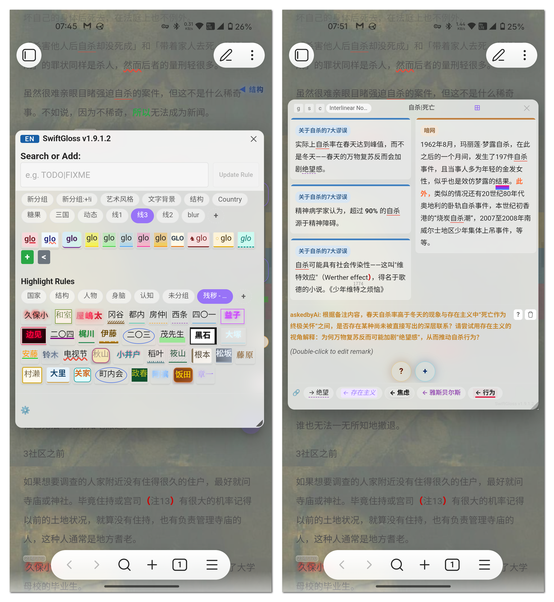

**义父/Patron daddy**:[莫问归期6666](https://b23.tv/TMXF3Jh)

SwiftGlean-demo(zh): https://github.com/dlsdgj/Obsidian-SwiftGloss-demo

# SwiftGlean / 积微探赜(zé) 

> **Note**: SwiftGlean was formerly named **SwiftGloss** (v1.9.3 and earlier). The plugin ID remains `regex-css-highlighter` for compatibility.
> 注意：SwiftGlean 原名 **SwiftGloss**（v1.9.3及更早版本）。插件ID保持 `regex-css-highlighter` 不变以兼容升级。

Highlight text with regex and custom CSS. Add interlinear notes above keywords, keyword-level remarks with backlinks, and AskMe AI questions to deepen understanding. (Formerly Regex CSS Highlighter)/通过正则表达式匹配文本并应用自定义CSS高亮。支持在关键词上方添加行间注释、关键词级别的带反链批注，以及AskMe AI提问以加深理解。（原 Regex CSS Highlighter）

## Features / 功能特性

### 🎨 Style Highlighting / 样式高亮

Style Highlighting / 样式高亮

- Regex Matching + CSS Styles / 正则匹配 + CSS 样式 — Match text using regular expressions and apply custom CSS styles to matched content / 使用正则表达式匹配文本，为匹配内容应用自定义 CSS 样式
- Style Category Management / 样式分类管理 — Styles organized by groups, with support for adding, editing, and deleting / 样式按分组分类，支持添加、编辑、删除样式
- Instant Style Application / 样式即时生效 — Styles take effect immediately after adding/editing/deleting, no restart required / 添加/编辑/删除样式后无需重启，立即在笔记中生效
- Floating Style Buttons / 样式悬浮按钮 — Right-click a style button to create a draggable floating button with adjustable size and opacity / 右键样式按钮可创建可拖动的悬浮按钮，支持调整大小和透明度
- Style Button Context Menu / 样式按钮右键菜单 — Copy class name, copy full style, float display, and other quick actions / 复制类名、复制完整样式、悬浮显示等快捷操作

### Add Style / 添加样式

### 📱 Mobile Adaptation / 移动端适配

Mobile Adaptation / 移动端适配

### 📌 Notes / 备注功能

Notes / 备注功能

- Text Notes / 文本备注 — Add notes to highlighted text with Markdown rendering support / 为高亮文本添加备注，支持 Markdown 渲染
- Image Support / 图片支持 — Note popup supports uploading images and pasting from clipboard / 备注弹窗支持上传图片和粘贴剪贴板图片
- Table Rendering / 表格渲染 — Notes support Markdown tables with borders and zebra striping / 备注支持 Markdown 表格，带边框和斑马纹样式

## Installation / 安装

Search for "Regex Css Highlighter" in Obsidian Settings → Community Plugins → Browse to install directly.
在 Obsidian 设置 → 社区插件 → 浏览 中搜索 "Regex Css Highlighter" 直接安装。

Manual Installation / 手动安装

1. Download `main.js` and `manifest.json` / 下载 `main.js`、`manifest.json`
2. Create a `Regex-Css-Highlighter` folder in your Obsidian vault's `.obsidian/plugins/` directory / 在 Obsidian 库的 `.obsidian/plugins/` 目录下创建 `Regex-Css-Highlighter` 文件夹
3. Place the downloaded files in that folder / 将下载的文件放入该文件夹
4. Enable "Regex Css Highlighter" in Obsidian Settings → Community Plugins / 在 Obsidian 设置 → 社区插件中启用 "Regex Css Highlighter"

## Changelog / 更新日志

Changelog / 更新日志

v1.9.3 (2026-07-07)

- **Desktop Chips Drag / 桌面端chips区拖动窗口** — Click empty area in bottom chips bar to drag popup on desktop (previously mobile-only) / 桌面端点击chips区空白处可拖动窗口（此前仅手机端）
- **n Badge Position / n按钮位置上移** — Moved "n" remark badge upward to align with g/l badge / "n"按钮上移至与g/l按钮平行
- **Interlinear Note Key Fix / 行间注释key修复** — Fixed remark popup using ruleRegex as key instead of plain text, causing duplicate notes / 修复备注弹窗行间注释key不一致导致重复注释
- **Popup Close Button / 弹窗关闭按钮优化** — Hidden initially, shown after drag; red color / 初始隐藏，拖动后显示；红色

v1.9.2 (2026-07-07)

- **Desktop c/i Button Style / 桌面端c/i按钮样式优化** — Enlarged buttons (28×28px), hover keeps visible, auto-hide timer pauses on hover / 增大按钮尺寸，鼠标悬浮保持显示，自动隐藏暂停
- **Desktop c/i Button Right-click Edit / 桌面端c/i按钮右键编辑** — Right-click c/i buttons to edit display text, CSS class, or inline CSS / 右键c/i按钮可编辑显示文字、CSS类名、内联CSS
- **Masonry Remark Edit & Paste / 瀑布流备注编辑与粘贴** — Double-click remark content to edit in masonry mode; clipboard image paste support / 瀑布流双击备注内容编辑；支持粘贴剪贴板图片
- **Keyword Detail Image Render / 关键词详情图片渲染** — Fixed images not displaying in keyword detail window from bottom chips / 修复从底部chip打开的关键词详情窗口图片不显示

v1.9.1.4 (2026-07-06)

- **Mobile c/i Buttons / 手机端c/i按钮** — Added "c" (add/remove count) and "i" (add/edit interlinear note) buttons to mobile highlight actions alongside l/g and n / 手机端点击高亮关键词时，在l/g和n按钮旁新增"c"（计数）和"i"（行间注释）按钮
- **Desktop Rule Action Buttons / 桌面端规则操作按钮** — Selecting rule text auto-shows c/i buttons next to floating ball in both always and followSelection modes / 桌面端选中规则文本时自动在悬浮球旁显示c、i按钮
- **Per-Platform Floating Ball Visibility / 悬浮球可见性按平台独立** — Split floatingBallHidden into per-platform storage so hiding on mobile doesn't affect desktop after sync / 悬浮球隐藏设置按平台独立存储，手机端隐藏不影响桌面端

v1.9.1.3 (2026-07-06)

- **Fix AI Question Remark Lost / 修复AI问题备注丢失** — Fixed edited AI question remarks disappearing after closing and reopening popup: pre-save condition treated empty `filePath` as falsy, now uses `!== undefined` check / 修复编辑AI问题备注后退出再双击编辑时内容消失：预保存条件将空`filePath`当作falsy跳过，改为`!== undefined`检查

v1.9.1.2 (2026-07-06)

- **Fix Add/AI Button / 修复添加/AI按钮** — Fixed "+" and "?" buttons not working in hover remark popup: auto-finds rule from list, re-reads links from DOM / 修复备注弹窗"+"和"?"按钮无效：自动查找规则，从DOM重新读取links
- **Masonry Toolbar Fix / 瀑布流工具栏修复** — Restored hover toolbar with pointer-events control; dblclick toolbar to edit remark, dblclick search chip to edit search text / 恢复悬浮工具栏；双击toolbar编辑备注，双击搜索词chip编辑搜索词
- **Button Order Swap / 按钮顺序对调** — Swapped "Open Document" and "Copy" button positions / "打开文档"和"复制"按钮位置对调
- **Masonry Mode Persistence / 瀑布流模式持久化** — Masonry mode state saved to settings, persists across restarts / 瀑布流模式状态持久化，重启不丢失

v1.9.1.1 (2026-07-05)

- **Frosted Glass Popups / 毛玻璃弹窗** — All popups now use frosted glass effect with `backdrop-filter:blur(16px) saturate(180%)` + semi-transparent background / 所有弹窗统一使用毛玻璃效果，替换原有实心背景
- **Remove Popup Borders / 移除弹窗边框** — Removed all popup borders and border width/color settings, unified border-radius to 12px / 移除所有弹窗边框及边框宽度/颜色设置项，统一圆角为12px
- **Transparent Inner Elements / 内部元素透明化** — Title bars, content containers, chips bars, masonry cards, dividers all use transparent/semi-transparent backgrounds / 标题栏、内容容器、chips区域、瀑布流卡片、分隔线全部改为透明/半透明背景
- **Ribbon Icon Rename / 侧边栏按钮更名** — Changed sidebar ribbon icon tooltip to "SwiftGloss" / 侧边栏功能区按钮提示文字改为"SwiftGloss"

v1.9.1 (2026-07-05)

- **Count Styles Hardcoded / 计数样式硬编码** — Hardcoded count badge CSS into main.js, fixing count badges not displaying on fresh installations / 将计数标记CSS样式硬编码到main.js中，修复新装插件时计数标记不显示的问题

v1.9.0 (2026-07-05)

- **Masonry Layout Mode / 瀑布流模式** — New masonry/waterfall layout for remark popups: all entries mixed as cards with file name tags, color bar replacing dots, hover toolbar, search keyword placeholder + drag-drop, dynamic columns via ResizeObserver / 备注弹窗新增瀑布流布局：所有条目混排为卡片，文件名作为标签，顶部色条替代圆点，hover显示工具栏，搜索词占位+拖放支持，ResizeObserver动态栏数
- **Remark Popup Code Reuse / 备注弹窗代码复用** — Extracted `renderRemarkContent` shared function, both popups share content rendering, reducing ~774 lines of duplicate code / 提取 `renderRemarkContent` 共享函数，两个弹窗共享内容渲染逻辑，减少约774行重复代码
- **Remark Link Fix After File Rename / 文件改名后备注链接修复** — Fixed remark links not updating after file rename / 修复文件改名后备注弹窗中引用的文件路径未更新的bug

v1.8.9.7 (2026-07-05)

- **Remark Link Fix After File Rename / 文件改名后备注链接修复** — Fixed remark links not updating after file rename — moved links update logic outside the conditional guard, replaced `fileRules` Map iteration with `_fileRulesData` traversal, ensuring all links.filePath are correctly updated / 修复文件改名后备注弹窗中引用的文件路径未更新的bug：将 links 更新逻辑移出条件守卫，改用 `_fileRulesData` 遍历替代 `fileRules` Map 遍历，确保无论被重命名文件是否有自身规则、其他文件规则是否已加载，所有 links.filePath 都能正确更新

v1.8.9.6 (2026-07-04)

- **Remove Mobile Reading Mode Line/Margin Setting / 移除手机版阅读模式行、边距设置** — Removed "Mobile Reading Mode Line & Margin" setting and applyMobilePreviewMargins method — now handled by another plugin / 移除"手机版阅读模式行、边距"设置项及 applyMobilePreviewMargins 方法，已改用其他插件实现
- **Floating Ball Hide/Show / 悬浮球隐藏/显示功能** — Floating ball now hides when "Hide Floating Buttons" is clicked; added left ribbon icon to open main panel; added "Show/Hide Floating Ball" chip at top of floating ball settings / 点击"隐藏悬浮按钮"时同步隐藏悬浮球，添加左侧功能区按钮打开主面板，主面板设置-悬浮球选项顶部添加"显示/隐藏悬浮球"chip
- **Remove Mobile Pinyin Pin Button / 移除手机版注音📌按钮** — Hidden the 📌 pin button after the "Pinyin" option in mobile floating ball menu / 手机端悬浮球菜单中"注音"选项后的📌按钮已隐藏
- **Floating Ball Display Fix / 悬浮球显示修复** — Fixed "SG" text not centered when floating ball is re-shown — restored display to flex / 修复悬浮球重新显示时"SG"文本未居中的问题，恢复 display 为 flex

v1.8.9.5 (2026-07-04)

- **Mobile Panel Interaction Fix / 手机端主面板交互修复** — Fixed critical mobile bug where long-pressing style/rule buttons caused browser selection mode, making the panel impossible to close — resolved by calling preventDefault on touchstart for interactive elements and manually handling tap-to-click / 修复手机端长按样式/规则按钮后浏览器进入选择模式导致面板无法关闭的严重bug，通过在交互元素 touchstart 上 preventDefault 阻止浏览器长按检测，并手动处理 tap 触发 click
- **Mobile Close Button Fix / 手机端关闭按钮修复** — Close button now has rch-close-btn class, contextmenu event serves as fallback close channel after long-press / 关闭按钮添加 rch-close-btn 类名，contextmenu 事件作为长按后的备用关闭通道
- **Mobile Outside-Click Close / 手机端外部点击关闭** — Document-level contextmenu listener as fallback outside-click close channel on mobile / document 级别 contextmenu 监听作为面板外部点击的备用关闭通道
- **Drag Listener Leak Fix / 拖拽监听器泄漏修复** — Fixed anonymous mousemove/mouseup listener leak — converted to named references, properly cleaned up in onClose/onOpen / 将匿名 mousemove/mouseup 监听器改为具名引用，在 onClose/onOpen 中正确清理
- **Context Menu Cleanup / 右键菜单清理** — Clean up residual context menu document event listeners in onClose / onClose 中清理残留的右键菜单 document 事件监听器
- **Close Deadlock Fix / close() 死锁修复** — Removed _locked check in close(), mobile outsideClickHandler ignores _locked state / 移除 close() 中的 _locked 检查，手机端 outsideClickHandler 忽略 _locked 状态
- **i18n Keys Completion / i18n key 补全** — Added missing i18n keys for main panel UI elements / 添加 main.localRule、main.globalRule 等缺失的中英文字典 key
- **Mobile Context Menu Block / 手机端长按菜单屏蔽** — Desktop-only contextmenu registration for style/rule buttons, mobile only prevents default / 样式按钮和规则按钮的 contextmenu 注册用 _isDesktop 包裹
- **Mobile Remark Option Hidden / 手机端备注选项隐藏** — Hide "Edit Remark" option and remark hover on mobile / 规则按钮右键菜单的"编辑备注"和备注悬浮在手机端隐藏
- **Menu Item Order / 菜单项顺序调整** — "Move to Group" moved to top, "Move to Local Rule" placed in its submenu / "移动到分组"移到菜单顶部，"移动到当前文件规则"放入其子菜单
- **Submenu Overflow Fix / 二级菜单溢出修复** — Desktop submenu bottom overflow check, mobile submenu expands downward with maxHeight / 桌面端子菜单添加底部溢出检查，手机端子菜单改为向下展开+maxHeight

v1.8.9.4 (2026-07-03)

- **File Rule Path Leading Slash Fix / 文件规则路径前缀斜杠修复** — Auto-detects and removes leading `/` from file rule keys on startup, fixing root-level file rules not loading — one-time migration / 启动时自动检测并移除库根文件夹下文件规则 key 的前缀 `/`，修复根目录文件规则无法加载的问题，一次性迁移

v1.8.9.3 (2026-07-03)

- **Legacy Remark Auto-Migration / 旧版备注自动迁移** — Automatically migrates legacy `rule.remark` to `link` entries (`filePath: ""`) on startup, clears the old field and persists changes / 启动时自动将旧版 `rule.remark` 迁移为 `link` 条目（`filePath: ""`），迁移后清空旧字段并持久化
- **Global Rule Popup Shows File Rule Remarks / 全局规则弹窗显示文件规则备注** — Global rule remark popup now also shows file rule remarks for the same regex from all files, with an "l" badge after the file name / 全局规则备注弹窗中追加显示同 regex 的所有文件规则备注，文件名后标注"l"标记以区分来源
- **File Rule Reference Remarks Read-Only / 文件规则引用备注只读保护** — File rule reference remarks are read-only in the global popup — no edit/delete toolbar shown / 来自文件规则的引用备注不显示编辑/删除工具栏，避免误操作

v1.8.9.2 (2026-07-02)

- **Interlinear Note Font Size Persistence Fix / 行间注释字体大小持久化修复** — Fixed `injectInterlinearNoteStyles` always using default CSS instead of user-customized CSS, causing interlinear note styles to revert to defaults after restart / 修复 `injectInterlinearNoteStyles` 始终使用默认CSS而非用户自定义CSS，导致重启后行间注释字体大小等样式恢复默认的bug
- **Interlinear Note + Count Coexistence / 行间注释与计数共存** — When a keyword has both interlinear note and count, the note automatically moves below the keyword while count stays above; `has-counter` class added at creation time to avoid timing issues / 当关键词同时有行间注释和计数时，行间注释自动移至关键词下方、计数保持在上方，创建时即添加 `has-counter` 类避免时序问题

v1.8.9.1 (2026-07-02)

- **Count Feature / 计数功能** — Added "c" count button to remark popup title bar and "Add Count" option to floating ball menu; clicking adds frosted-glass count badges (showing "position/total") to matched text, clicking again removes count / 备注弹窗标题栏添加"c"按钮，悬浮球菜单添加"添加计数"选项，点击后为匹配文本添加毛玻璃计数标记（显示"位置/总数"），再次点击移除计数
- **Count Persistence / 计数持久化** — Count state persisted to settings, automatically restored after Obsidian restart / 计数状态保存到settings，重启Obsidian后自动恢复
- **Reading Mode Count Fix / 阅读模式计数修复** — Fixed reading mode count: total computed from file content (not DOM), global index determined by paragraph text positioning, resolving inaccurate counts and scroll-dependent changes / 阅读模式总数从文件内容计算（非DOM），用段落文本定位确定全局序号，解决懒渲染下计数不准和滚动变化问题
- **Translation Completion / 翻译补全** — Completed missing Chinese/English translations for floating.openMainPanel, floating.addRemark, floating.removeHighlight, floating.pinyin, floating.formatReplace, settings.heading, settings.popup / 补全 floating.openMainPanel、floating.addRemark、floating.removeHighlight、floating.pinyin、floating.formatReplace、settings.heading、settings.popup 等缺失的中英文翻译
- **Random Mode Style Stacking Fix / 随机模式样式叠加修复** — Fixed floating group random mode adding new rule instead of replacing old one on second click, which caused two styles stacking / 修复悬浮分组随机模式第二次点击时新增规则而非替换旧规则，导致同一文本叠加两种样式的bug

v1.8.9 (2026-07-01)

- **Floating Group Random Mode / 悬浮分组随机模式** — Added "Random Mode" to floating style group right-click menu; when enabled, clicking the group directly applies a random style to selected text, arrow removed, hover does not expand submenu / 悬浮样式分组右键菜单新增"随机模式"，开启后点击分组直接随机应用组内样式到选中文本，移除箭头、鼠标悬浮不展开子菜单
- **Remove Open File Link Settings / 移除打开文件链接设置** — Removed "Hide open file link after title" setting option and "Open data.json" link next to ⚙️ / 移除主面板设置-显示中的"不显示标题后面的打开文件链接"选项及⚙️后的"打开data.json"链接
- **Remove Recent Rules Setting / 移除折叠时显示最近规则设置** — Removed "Show recent rules when collapsed" setting option from display settings / 移除主面板设置-显示中的"折叠时显示最近规则"选项
- **Default Heading Style Disabled / 默认不启用标题样式** — New installations now default to disabling heading styles and heading level labels / 新装插件默认禁用标题样式和标题层级标签显示
- **Default Group in Switchable Tabs / 默认分组显示在切换标签区域** — Auto-generated "New Group" now defaults to switchable tab area instead of always-visible area / 自动生成的"新分组"默认显示在切换标签区域（"+"按钮前），而非常显区域
- **English Preview Text Changed to gloss / 英文预览文本改为gloss** — Default English preview text changed from "Preview" to "gloss" / 默认英文预览文本从"Preview"改为"gloss"

v1.8.8.5 (2026-07-01)

- **Remove Style Usage Count / 移除样式使用次数(count)功能** — Completely removed `_count.json` count file generation and related code (`updateStyleCountFile`, `loadStyleCountFile`, `loadAngle0Styles`, 16 call sites, 6 i18n entries) / 完全移除 `_count.json` 计数文件生成机制及相关代码，包括 `updateStyleCountFile`、`loadStyleCountFile`、`loadAngle0Styles` 等函数，以及所有 16 处调用点和 6 条 i18n 条目
- **In-Memory Unused Styles / 随机高亮改为内存计算** — `getUnusedStyles` now computes unused styles from in-memory `fileRules` and `globalRules` instead of count files / `getUnusedStyles` 不再依赖 count 文件，改为从内存中的 `fileRules` 和 `globalRules` 实时统计未使用样式
- **Merge File Rules to Single JSON / 文件规则合并为单JSON** — Merged all file highlight rules from individual `data/{encoded_name}.json` into single `data/file-rules.json` using original file paths as keys / 所有文件高亮规则从 `data/{编码文件名}.json` 合并到 `data/file-rules.json`，key 使用原始文件路径，消除路径编码歧义
- **Memory Cache + Debounce Write / 内存缓存+Debounce写入** — `saveFileRules` writes to in-memory cache first, flushes to disk with 500ms debounce; `loadFileRules` reads from memory with zero IO / `saveFileRules` 先写入内存缓存，500ms debounce 后批量写磁盘，`loadFileRules` 从内存读取零IO
- **Auto Migration / 自动迁移旧数据** — Auto-migrates scattered rule files to `file-rules.json` on first launch, cleans up `_count.json` files, sets flag to avoid re-running / 首次启动时自动将零散规则文件迁移到 `file-rules.json`，同时清理所有 `_count.json` 文件，迁移完成后设置标志位不再重复执行
- **Simplified File Rename / 文件重命名简化** — File rename/move now operates on in-memory cache keys directly, no more filesystem-level rename / 重命名/移动文件时直接操作内存缓存 key，不再涉及文件系统级 rename 操作

v1.8.8.4 (2026-06-30)

- **Disable Rule in Context Menu / 禁用规则移至右键菜单** — Moved disable/enable rule from Shift+right-click to right-click context menu / 移除Shift+右键禁用规则操作，将禁用/启用规则选项添加到规则右键菜单中
- **Disable Rule Bug Fix / 修复禁用规则不生效** — Fixed rule disable not working due to shallow copy modifying clone instead of original rule object / 修复因浅拷贝导致修改副本而非原始规则对象，禁用规则提示成功但实际未生效的bug
- **Remark Popup Grouped by File / 备注弹窗按文件分组显示** — Remark hover popup now groups remarks by source file with filename labels and color dots; falls back to external remark / 悬浮备注弹窗优先显示links中的备注（按文件分组、带文件名标签和色点），无link备注时回退显示外部remark
- **Settings Bar Redesign / 设置栏底部固定改造** — Replaced collapsible settings panel with fixed bottom bar (⚙️ icon + chips); hover to show chips, click to open floating popup / 移除折叠式设置面板，改为⚙️图标+chip常驻面板底部，hover显示chips，点击chip弹出悬浮窗口
- **Settings Chip Floating Popup / 设置chip悬浮窗口** — Settings chip opens floating popup; auto-switch on hover between chips; delayed close on mouse leave / 点击chip弹出悬浮设置窗口，chip间划过自动切换内容，鼠标离开延迟关闭
- **Settings Bar Fixed at Bottom / 设置栏固定在面板底部** — Settings bar moved from contentEl to modalEl, always fixed at panel bottom / 设置栏从contentEl移至modalEl，始终固定在面板底部不随内容滚动
- **Settings Popup Click Fix / 修复点击设置弹窗退出主面板** — Fixed clicking settings popup closing main panel by adding popup to outsideClickHandler exclusion list / 在outsideClickHandler排除列表中添加设置弹窗，避免点击弹窗关闭主面板
- **Settings Popup Auto-Height / 设置弹窗自适应高度** — Removed max-height scroll limit; popup auto-sizes to content; MutationObserver repositions on content changes / 移除max-height滚动限制，弹窗自适应内容高度，内容展开时MutationObserver自动重新定位
- **Wider Popup for CSS Settings / 拼音/行间注释弹窗加宽** — Wider popup (460~700px) for Pinyin and Interlinear Note settings to accommodate textareas / 拼音样式和行间注释样式的设置弹窗使用更宽尺寸（460~700px）以容纳textarea

v1.8.8.3 (2026-06-30)

- **Remove Ctrl+Enter Update Rule / 移除Ctrl+Enter更新规则** — Removed non-functional Ctrl+Enter shortcut (intercepted by Obsidian global hotkeys); replaced with "Update Rule" chip button next to input field / 移除无效的Ctrl+Enter快捷键（Obsidian全局快捷键拦截），改用输入框右侧"更新规则"chip按钮
- **Update Rule Chip Button / 更新规则Chip按钮** — Added "Update Rule" chip button next to input; highlighted when a rule is selected, grayed out when no rule is selected / 输入框右侧新增"更新规则"chip按钮，点击规则按钮后高亮可用，无选中规则时灰色禁用
- **showErrorMessage Call Fix / showErrorMessage调用修复** — Fixed TypeError from calling showErrorMessage with wrong number of arguments / 修复`showErrorMessage`单参数调用导致styleOption.appendChild抛出TypeError的问题
- **editRule Boolean Return / editRule返回布尔值** — editRule/editGlobalRule now return boolean; updateCurrentRule checks return value to avoid false success messages / 规则编辑失败时返回false，`updateCurrentRule`检查返回值避免误报成功
- **Rule Button Highlight Border Fix / 规则按钮高亮边框修复** — Fixed highlight border not clearing on global rule buttons; removed blue/orange fixed borders in favor of transparent / 清除高亮时同时清除全局规则按钮边框；移除蓝色/橙色固定边框改为透明
- **Unified Theme Accent Highlight / 匹配高亮统一主题色粗边框** — Unified matching highlight to `2px solid var(--interactive-accent)` for both rule and style buttons; removed scale/glow effects / 规则按钮和样式按钮的匹配高亮统一为主题色粗边框，移除scale/发光效果
- **Rule Button Remark Hover / 规则按钮hover备注弹窗** — Added remark hover popup to global rule and history buttons, reusing editor remark popup styles / 全局规则按钮和history按钮添加备注hover弹窗，复用编辑区备注弹窗样式
- **Auto-Expand Rule Group / 选中文本自动展开规则分组** — Auto-expand rule group chip when matching rule button is found, ensuring highlight is visible / 匹配规则按钮时自动展开其所在规则分组chip，确保高亮可见
- **Style Button data-class Fix / 样式按钮data-class修复** — Fixed style buttons missing `data-class` attribute, which was the root cause of style chips not auto-activating and style buttons not being highlighted / 修复样式按钮未设置`data-class`属性导致样式chip不自动激活、样式按钮不高亮的根本问题

v1.8.8.2 (2026-06-29)

- **Chip Activation Rule Buttons Fix / Chip激活后规则按钮修复** — Fixed rule buttons disappearing after clicking group chip in highlight rules section; clear maxHeight restriction and restore button display on activation / 修复高亮规则区域点击分组chip后规则按钮消失的问题；激活分组时清除maxHeight限制并恢复按钮display
- **Rule Deletion Index Fix / 规则删除索引修复** — Fixed wrong index used when deleting rules via right-click/middle-click; use globalRules index instead of allRules index / 修复右键/中键删除规则时使用allRules索引而非globalRules索引导致删除失败或删错规则的问题
- **Global Rule Move Fix / 全局规则移动修复** — Fixed global rule not removed after moving to current file (was copying instead of moving) / 修复移动全局规则到当前文件时原全局规则仍保留的问题（复制而非移动）
- **Deletion Message Fix / 删除提示修复** — Fixed file rule deletion showing "global rule deleted" message; now shows correct message based on rule type / 修复删除文件规则时显示全局规则删除提示的问题，现在区分文件/全局规则显示不同提示
- **deleteRuleById TypeError Fix / deleteRuleById调用修复** — Fixed TypeError from calling deleteRuleById on plugin instead of modal instance / 修复`this.plugin.deleteRuleById`应为`this.deleteRuleById`导致的TypeError
- **File Rule Move to Group Fix / 文件规则移到分组修复** — Fixed file rule reappearing after moving to group; convert to global rule and remove from file rules before assigning to group / 修复文件规则移到分组后刷新页面规则重新出现的问题；移到分组时先转为全局规则再从文件规则中删除

v1.8.8 (2026-06-24)

- **Remark Popup Save Button / 备注弹窗保存按钮** — Added "s" button in popup title bar for saving remark as file; removed right-click context menu "Save as File" option / 备注弹窗标题栏新增"s"保存文件按钮；移除右键菜单的"保存为文件"选项
- **Remark Popup Interlinear Note Field / 备注弹窗行间注释文本框** — Replaced "i" button with always-visible text field in title bar for interlinear note; supports double-click to edit and drag-drop text to set note / 备注弹窗标题栏新增常显行间注释文本框，替代原"i"按钮；支持双击编辑和拖放文本设置行间注释
- **Remark Popup Title Bar Layout / 备注弹窗标题栏布局** — Buttons (g/l, s, inNote) grouped tightly on the left; keyword name stays centered with original width / 按钮左侧紧凑排列；关键词名居中保持原宽度
- **Remark Popup Resize Handle / 备注弹窗调整大小手柄** — Added resize handle at bottom-right corner; supports mouse drag and mobile touch to adjust height / 右下角新增resize手柄，支持鼠标和手机触摸调整高度
- **Chip Window Touch Resize / Chip弹窗触摸调整大小** — Added touch support to chip window resize handle; fixed onTouchEnd not resetting isResizing state / Chip弹窗resize手柄支持触摸；修复调整后点击弹窗移动右下角的bug
- **Chips Bar Touch Drag / Chips区域触摸拖动** — Bottom chips area in both remark popup and chip window supports touch drag to move / 备注弹窗和chip弹窗底部chips区域支持触摸拖动移动弹窗

v1.8.7 (2026-06-23)

- **Chip Window Max Height / Chip弹窗最大高度** — Added max-height limit to keyword-detail-window; long remarks scroll inside content area instead of expanding infinitely, preventing mobile freeze and bottom buttons being pushed off-screen / 给chip打开的关键词窗口添加max-height限制；长备注在内容区内滚动而非无限撑开，避免移动端卡死和底部按钮被推出视口
- **Chip Window "+" and "?" Buttons / Chip弹窗"+"和"?"按钮** — Added floating "add remark" and "AI question" buttons at bottom of chip window, matching remark popup style / chip弹窗底部新增悬浮的添加备注和AI提问按钮，样式与首个弹窗一致
- **Chip Window Double-click Edit / Chip弹窗双击编辑** — Double-clicking remark content in chip window now enters edit mode; blur saves and replaces in-place without rebuilding the window / chip弹窗中双击备注内容进入编辑模式；失焦保存后就地替换内容，不重建窗口
- **Chip Window AI Question Buttons / Chip弹窗AI问题按钮** — Added "?" (break down question) and "delete" buttons to askedbyAi entries in chip window / chip弹窗askedbyAi条目添加"?"拆解按钮和"删除"按钮
- **Chip Window Empty Remark Hint / Chip弹窗空备注提示** — Empty remark entries now show "(双击编辑备注)" placeholder text / 空备注条目显示"(双击编辑备注)"占位文字
- **Chip Window Resize Beyond Default / Chip弹窗调整大小突破默认限制** — Drag-resizing chip window now syncs max-height, allowing users to expand height beyond the default limit / 拖动调整chip弹窗大小时同步更新max-height，允许用户将高度拖大超过默认值
- **Chip Window Size Preservation / Chip弹窗大小保持** — After editing or adding remarks via AI/"+" buttons, chip window preserves user-adjusted size and position instead of resetting to defaults / 编辑或通过AI/"+"按钮添加备注后，chip弹窗保持用户调整的大小和位置，不再重置为默认值
- **Remark Popup Width Fix / 备注弹窗宽度修复** — Fixed remark popup width unable to shrink after exiting edit mode; renderAllRemarks now resets minWidth lock / 修复退出编辑后备注弹窗宽度无法调小的问题；renderAllRemarks现在重置minWidth锁定

v1.8.6 (2026-06-23)

- **AI Question Feature / AI提问功能** — Added "?" button next to "+" in remark popup; AI generates targeted questions based on keyword and related keyword remarks to help deepen understanding / 备注弹窗"+"按钮旁新增"?"按钮；AI根据关键词及关联词备注生成针对性问题，帮助深入理解
- **AI Conversation Thread / AI对话线程** — Each AI question supports multi-turn dialog: "?" asks AI to break down the question, "↗" sends user's answer for feedback; thread persisted in `_aiThread` / 每个AI问题支持多轮对话：点"?"请AI拆解问题，点"↗"将回答反馈给AI；对话线程持久化存储
- **AI Question Text Wrapping / AI提问文本换行** — Fixed long AI question text not wrapping in title bar / 修复AI问题标题长文本不换行问题
- **AI Question Persistence / AI提问持久化** — Fixed AI question entries being deleted on popup close when user hasn't answered / 修复弹窗关闭时未回答的AI提问条目被误删
- **DeepSeek Model Validation / DeepSeek模型校验** — Removed outdated model whitelist that caused false warnings during API test / 移除过时模型白名单，避免测试成功仍误报
- **Preview Language Switch Fix / Preview语言切换修复** — Fixed English mode reverting "Preview" to Chinese "示例" after canceling style edit / 修复英文模式下编辑样式取消后"Preview"变"示例"
- **Floating Group Arrow Fix / 悬浮分组箭头修复** — Fixed default-style floating group buttons appending duplicate arrows on each drag / 修复默认样式悬浮分组拖动时箭头不断追加

v1.8.5 (2026-06-22)

- **Random Highlight Group Filter i18n / 随机高亮分组限制国际化** — Fixed hardcoded Chinese strings not translating in English mode; added missing i18n keys and English translations; updated description with usage hint about selecting text and clicking the floating ball / 修复英文模式下标题、描述、空提示未翻译的问题；补充i18n键和英文翻译；描述新增选中文本后点击悬浮球的使用说明
- **Style Usage Count Badge Default Off / 样式使用次数角标默认关闭** — Changed default to disabled for new installations; added warning hint that enabling generates many count files in data folder / 新装插件默认不启用；添加警告提示启用后会在data中产生大量计数文件
- **Panel Title Rename / 主面板标题更名** — Changed main panel title from "regex css highlighter" to "SwiftGloss" / 主面板标题从"regex css highlighter"改为"SwiftGloss"

v1.8.4 (2026-06-22)

- **Interlinear Note + Style Coexistence Fix / 行间注释与样式高亮共存修复** — Reading mode now applies interlinear notes first then style highlights; `clearHighlights` preserves `in-note-wrapper` structure; notes with styles display correctly without scrolling / 阅读模式先应用行间注释再应用样式高亮；`clearHighlights`保护`in-note-wrapper`结构不被破坏；有行间注释的关键词样式正常显示，无需滚动
- **Mobile Pin Button Removal / 手机端移除📌按钮** — Removed 📌 float buttons from group/style buttons in main panel on mobile to prevent accidental taps / 手机端主面板中分组/样式按钮不再显示📌浮动按钮，防止误触
- **SwiftSwitch Hint / SwiftSwitch提示** — Added hint in CSS Snippets settings: desktop only, restart required, recommend SwiftSwitch with plugin link / CSS Snippets设置区域添加提示：仅支持桌面端，启用后需重启，建议使用SwiftSwitch（含插件链接）
- **Rule Edit Input Width / 规则编辑输入框宽度** — Double-click to edit rule name now enforces minimum 80px width so short rules remain readable / 双击编辑规则名时最小宽度80px，短规则也能看清文字

v1.8.3 (2026-06-21)

- **Remark Popup Improvements / 备注弹窗改进** — Pinned popup no longer closes on outside click; scroll/resize no longer resets position; custom resize handle; "+" button for adding remarks / 固定后点击外部不关闭；滚动/调整窗口不跳回原位；自定义resize手柄；"+"按钮添加备注
- **Keyword Detail Window Unification / Chip弹窗样式统一** — Chip popup style unified with remark popup; flex layout; entries show bullet+search tag+copy/open buttons; bottom chips with hover preview / Chip弹窗样式与备注弹窗统一；flex布局；条目显示圆点+搜索标签+复制/打开按钮；底部chips含悬浮预览
- **Chip Color Fix / Chip颜色修复** — Keywords using `color:transparent`+`background-clip:text` now extract gradient color for chip text / 使用渐变文字样式的关键词现在从渐变色提取chip文字颜色
- **Jump Highlight / 跳转高亮** — Jump-to-document highlights search text (marshmallow style); CM6 Decoration in edit mode, Range.surroundContents in read mode / 跳转文档后高亮搜索文本（棉花糖风格）；编辑模式CM6 Decoration，阅读模式Range包裹
- **Random Highlight Group Filter / 随机高亮分组限制** — Chips selector in floating ball settings to limit random styles to specific groups / 悬浮球设置中chips选择器限制随机样式仅从指定分组选择
- **Interlinear Notes / 行间注释** — New feature: select text → floating input → `::before`/CM6 Decoration display; independent storage; 6 presets + alignment + custom CSS / 新功能：选中文本→浮动输入框→伪元素/CM6显示；独立存储；6种预设+对齐方式+自定义CSS
- **Chip Popup Refinements / Chip弹窗细节** — Smaller bullets, compressed margins, user-select:text, drag-to-pin close, long-press ✕ closes all, editable search/rule name, mobile touch / 更小圆点、压缩间距、文字可选中、拖动后✕关闭、长按✕关闭全部、搜索词/规则名可编辑、手机触控
- **Piped Regex Matching / 含|规则匹配** — Rules with `|` now correctly matched in chips backlinks via `plainTexts` array / 含`|`的规则现在通过`plainTexts`数组正确匹配chips反向链接
- **Interlinear Notes Refactor / 行间注释重构** — `in-note-wrapper` replaces per-character spans; `!important` reset; inherits gradient styles; alignment setting / `in-note-wrapper`替代逐字span；`!important`重置；继承渐变样式；对齐方式设置
- **Remark Popup Interaction / 备注弹窗交互** — No popup on text selection; delayed refresh after close; new "Hide popup on selection" setting / 选中文本不弹窗；关闭后延迟刷新；新增"选中文本时不弹出备注"设置
- **Mobile Fixes / 手机版修复** — Short tap closes current / long press closes all; prefer live selection; mousedown excludes INPUT / 短按关闭当前/长按关闭全部；优先使用实时选区；mousedown排除INPUT元素

v1.8.2 (2026-06-19)

- **Floating Ball Label / 悬浮球标签** — Changed floating ball text from "rch" to "SG" / 将悬浮球文字从"rch"改为"SG"
- **Pinyin Submenu Pin Buttons / 注音子菜单📌按钮** — Added 📌 pin buttons to all pinyin submenu items (Add Pinyin Local/Global, Edit Pinyin File, Remove Pinyin) for floating display / 为注音子菜单所有选项（添加注音局部/全局、编辑注音文件、删除注音）添加📌按钮，支持悬浮显示
- **Font Switch Hover Submenu / 切换字体悬停子菜单** — Changed "Font Switch" option from click-to-open to hover-to-open submenu, consistent with other submenu options; added 📌 pin buttons to font switch submenu items / 将"切换字体"选项从点击弹出改为悬停弹出子菜单，与其他选项操作一致；为字体切换子菜单项添加📌按钮
- **Submenu Pin Button Fix / 子菜单📌按钮修复** — Fixed pinned submenu items showing raw option IDs instead of localized labels, and fixed click handlers not working when pinned as floating buttons / 修复📌钉住的子菜单项显示原始ID而非本地化名称，以及点击处理函数不生效的问题
- **Global Rules Scroll Fix / 全局规则滚动修复** — Removed the independent scrollbar in the global rules section; now uses the main panel scrollbar for unified smooth scrolling / 移除全局规则区域的独立滚动条，统一使用主面板滚动条，滚动体验一致

v1.8.1 (2026-06-19)

- **Single-Display Group Fix / 单显分组修复** — Fixed single-display groups being incorrectly moved to always-display area when highlighting matched styles; single-display groups now stay in their tab area with proper style button highlighting / 修复选中高亮关键词打开主面板时单显分组被错误移到常显区的问题；单显分组现在正确保持在标签区域，样式按钮正常高亮
- **Single-Display Style Buttons Fix / 单显样式按钮修复** — Fixed style buttons always appearing collapsed when reopening the main panel with an active single-display group; buttons now correctly display as expanded / 修复重新打开主面板时单显分组激活但样式按钮总是折叠的问题；按钮现在正确显示为展开状态
- **Single-Display Tab Arrow / 单显标签指示器** — Changed the active single-display tab indicator from a triangle arrow to a red horizontal line for clearer visual identification / 将单显标签激活指示器从三角形箭头改为红色粗横线，更清晰地标识激活状态
- **Snippet Manager Disable / Snippet 管理器禁用** — When "Enable Snippet Manager" is unchecked, the snippets list and status bar option are now hidden in settings, fully disabling the feature / 不勾选"启用 Snippet 管理器"时，设置中的 snippets 列表和状态栏选项被隐藏，完全禁用该功能

v1.7.7 (2026-06-19)

- **Snippet Manager / Snippet 管理器** — New CSS Snippets management feature with a frosted-glass popup window: toggle snippets on/off via chips, add/edit/delete/copy snippets, edit with external program, drag chips to reorder / 新增 CSS Snippets 管理功能，毛玻璃弹窗：通过 chips 切换启用/禁用，添加/编辑/删除/复制 snippets，外部程序编辑，拖拽排序
- **Snippet Groups / Snippet 分组** — Organize snippets into collapsible groups; right-click to add/rename/delete groups; drag chips between groups; "Ungrouped" section for unassigned snippets / 将 snippets 组织到可折叠分组中；右键添加/重命名/删除分组；拖拽 chips 到分组；"未分组"区域显示未分配的 snippets
- **Status Bar Button / 状态栏按钮** — Optional "CSS" button in the status bar for quick access to the snippet manager / 可选的状态栏"CSS"按钮，快速打开 snippet 管理器
- **Enable Heading Styles / 启用标题样式** — Reversed "Disable Heading Styles" setting to "Enable Heading Styles" with inverted logic; heading styles are now enabled by default / 将"禁用标题样式"设置逆转为"启用标题样式"，逻辑反转；标题样式默认启用
- **Snippet Manager Toggle / Snippet 管理器总开关** — Added master switch to enable/disable the entire snippet manager feature / 添加总开关控制整个 snippet 管理器功能的启用/禁用
- **Custom Input Dialog / 自定义输入弹窗** — Replaced unsupported Electron `prompt()` with a custom frosted-glass input dialog for group naming / 用自定义毛玻璃输入弹窗替代 Electron 不支持的 `prompt()`，用于分组命名

v1.7.6 (2026-06-17)

- **Plugin Startup Performance Optimization / 插件启动性能优化** — Cached `require('fs')`/`require('path')` at module level to eliminate repeated `require` calls; cached `styles.css` content to reduce 5 disk reads to 1; batched all `saveData()` calls in `onload()` from 10+ async writes to at most 1; parallelized independent async operations (`loadStyleCategories`, `loadGlobalRules`, `_preloadPinyinData`) with `Promise.all`; eliminated duplicate `style-categories.json` reads in `syncStylesToCategories`; deferred `cacheHoverStyles()` to lazy-load on first use instead of blocking startup; fixed `_preloadPinyinData()` being called twice / 将 `require('fs')`/`require('path')` 缓存至模块级别，消除重复 `require` 调用；缓存 `styles.css` 内容，将5次磁盘读取减少为1次；将 `onload()` 中的 `saveData()` 调用从10+次异步写入合并为最多1次；使用 `Promise.all` 并行化独立异步操作（`loadStyleCategories`、`loadGlobalRules`、`_preloadPinyinData`）；消除 `syncStylesToCategories` 中 `style-categories.json` 的重复读取；将 `cacheHoverStyles()` 延迟到首次使用时懒加载，不再阻塞启动；修复 `_preloadPinyinData()` 被重复调用的问题

v1.7.5 (2026-06-15)

- **Remark Popup File Name Sync Fix / 备注弹窗文件名同步修复** — Fixed file name in remark popup not updating after renaming a note; `handleFileRenameOrMove` now updates `links[].filePath` in all rules (current file, global, and other files) and persists changes to disk / 修复重命名笔记后备注弹窗中文件名不更新的问题；`handleFileRenameOrMove` 现在会更新所有规则（当前文件、全局、其他文件）中的 `links[].filePath` 并持久化到磁盘

v1.7.4 (2026-06-14)

- **Dark Mode Title Visibility Fix / 深色模式标题可见性修复** — Removed hardcoded `#555` color from "Single Display" and "Always Display" section titles, now uses default theme text color for proper visibility in dark mode / 移除"单显"和"常显"标题的 `#555` 硬编码颜色，现在使用默认主题文字颜色，深色模式下可正常显示
- **Single-display Tab Arrow Indicator / 单显标签箭头指示器** — Added a downward-pointing triangle arrow below the active single-display tab, visually connecting the tab to the content panel below / 在激活的单显标签下方添加向下的三角箭头，视觉上连接标签与下方内容面板

v1.7.3.1 (2026-06-14)

- **Release Asset Fix / Release 资源文件修复** — Fixed missing main.js and manifest.json in v1.7.2 GitHub release assets / 修复 v1.7.2 GitHub release 中缺少 main.js 和 manifest.json 的问题

v1.7.2 (2026-06-14)

- **Group Button Default Style / 分组按钮默认样式** — Changed group button default style from blue background with white text to white background with black text; custom styles now properly override the default / 分组按钮默认样式从蓝底白字改为白底黑字；自定义样式现在可正确覆盖默认样式
- **Single-display Tab Element Fix / 单显标签元素修复** — Changed single-display tab from `<button>` to `<h4>` element, fixing custom styles (gradient backgrounds, custom colors) not applying correctly / 单显标签从 `<button>` 改为 `<h4>` 元素，修复自定义样式（渐变背景、自定义颜色）无法正确应用的问题
- **Single-display Active State Persistence / 单显分组激活状态持久化** — Single-display group active state is now saved and restored when reopening the main panel / 单显分组的激活状态现在会被保存，重新打开主面板时自动恢复

v1.7.1 (2026-06-14)

- **Remark Badge Click Popup Fix / 备注徽章点击弹窗修复** — Fixed remark popup not appearing immediately when clicking the "n" badge to add a remark while hover delay is non-zero; popup now shows instantly and is protected from accidental mouseout cancellation / 修复悬浮延迟非0时点击"n"徽章添加备注弹窗不立即显示的问题；弹窗现在立即显示且不受鼠标移出意外取消
- **Default Settings for New Install / 新装插件默认设置** — New installs now default to: showRemarkBadge=true, remarkBadgeThreshold=2, popupLineHeight=1.5, popupBorderWidth=2, popupBorderColor=#ffffff / 新安装默认值：showRemarkBadge=true, remarkBadgeThreshold=2, popupLineHeight=1.5, popupBorderWidth=2, popupBorderColor=#ffffff

v1.7.0 (2026-06-10)

- **Mobile Context Menu Fix / 手机版右键菜单修复** — Fixed long-press style button options freezing, clicks not responding, and options remaining visible after closing the main panel on mobile / 修复长按样式按钮选项卡死、点击无反应、关闭主面板后选项仍显示的问题
- **Mobile Submenu Removal / 手机版移除子菜单** — Removed "Add as Heading Style" and "Move to Group" submenus on mobile (they rely on mouse hover events which don't work on touch devices) / 移除手机端"添加为标题样式"和"移动到分组"子菜单（依赖鼠标悬浮事件，手机无法操作）
- **Remark Popup Hover Delay / 备注弹窗悬浮延迟** — Added setting to control how long the mouse must hover over matched text before the remark popup appears; moving the mouse away before the delay cancels the popup, preventing accidental triggers / 新增设置项，控制鼠标悬浮多久后显示备注弹窗，鼠标提前离开则取消显示，防止意外触发
- **Add Group Instant Refresh / 添加分组即时刷新** — Fixed new groups not appearing in the main panel after adding; panel now refreshes immediately / 修复添加新分组后主面板不显示，需重新打开才显示的问题

v1.6.9 (2026-06-09)

- **Single-display Group Pin Button Fix / 单显分组📌按钮修复** — Changed single-display tab 📌 button from inline to absolute positioning (matching always-visible groups), removed overflow:hidden that was clipping the button / 单显标签📌按钮改为绝对定位（与常显分组一致），移除overflow:hidden裁切问题
- **Main Panel Dark Background Fix / 主面板暗色背景修复** — Injected !important CSS rule (.rch-transparent-bg) to forcefully override Obsidian's default modal-bg background, combined with MutationObserver for triple-layer protection / 注入!important CSS规则(.rch-transparent-bg)强制覆盖Obsidian默认modal-bg背景，配合MutationObserver三重保障
- **Main Panel Lock Improvement / 主面板锁定功能完善** — Lock button now directly sets pointer-events on modal-bg and modal-container to allow editor interaction when locked; fixed previously ineffective CSS class approach / 锁定按钮直接设置modal-bg和modal-container的pointer-events穿透，允许操作编辑器；修复之前无效的CSS class方案
- **Lock Focus Stealing Fix / 锁定焦点抢夺修复** — When locked, focusin events not triggered by user clicks on the panel are intercepted and focus is returned to the editor, preventing the panel from stealing focus / 锁定时拦截非用户点击触发的focusin事件，将焦点还给编辑器，防止面板抢夺焦点
- **Resize Handle Follows Panel / 调整大小按钮跟随面板** — Right-bottom resize handle now updates position in real-time when dragging the main panel / 拖动主面板时右下角调整大小按钮实时更新位置

v1.6.8 (2026-06-08)

- **Popup z-index Improvement / 弹窗层级优化** — Sub-modals (add group, rename, CSS editor, etc.) now appear above the main panel by raising their own z-index instead of lowering the main panel's, preventing Obsidian's sidebar divider from overlapping the panel / 子弹窗（添加分组、重命名、CSS编辑器等）现在通过提升自身z-index显示在主面板上方，而非降低主面板z-index，避免Obsidian侧边栏分割线覆盖主面板

v1.6.7 (2026-06-08)

- **Sticky Title Bar / 标题栏固定** — Main panel title bar now stays fixed at the top when scrolling content / 主面板滚动时标题栏固定在顶部不动
- **Scrollbar Position Fix / 滚动条位置修复** — Resizing the main panel no longer causes the scrollbar to jump to the left of the close button / 调整主面板大小时滚动条不再跳到关闭按钮左侧
- **Removed Display Settings / 移除显示设置** — Removed "Main Panel Opacity" and "Main Panel Width" settings from Display section; Ctrl+scroll and Alt+scroll shortcuts still work / 移除"显示"项下"主面板透明度"和"主面板宽度"设置，Ctrl+滚轮和Alt+滚轮快捷键仍可使用
- **Instant Group Toggle / 分组切换即时生效** — Toggling "Hide All Groups by Default" now immediately refreshes the panel instead of waiting for next open / 切换"默认隐藏所有分组"后立即刷新主面板，无需等待下次打开
- **Popup z-index Fix / 弹窗层级修复** — CSS editor and remark editor popups now correctly appear above the main panel / CSS编辑器和备注编辑弹窗不再被主面板遮挡
- **Cancel Button Optimization / 取消按钮优化** — Clicking "Cancel" in CSS editor no longer triggers unnecessary UI refresh / CSS编辑器点击"取消"不再触发不必要的UI刷新
- **Toggle Collapse Performance / 折叠展开性能** — Expand/collapse operations no longer wait for file save, eliminating 1.7s delay after CSS editor closes / 展开/折叠操作不再等待文件保存，消除CSS编辑器关闭后1.7秒延迟
- **Main Panel Open Speed / 主面板打开速度** — Deferred rendering of rules/settings sections, removed forced reflows, and batched font fixes for faster panel opening / 延迟渲染规则/设置区域，移除强制重排，批量字体修复，加快面板打开速度

v1.6.6 (2026-06-07)

- **Rule Conversion Merge / 规则转换合并** — When converting a rule between global and local, if a rule with the same regex already exists in the target, the cssClass is overwritten and remark/links are merged instead of blocking the conversion / 全局/局部规则转换时，若目标已存在同regex规则，cssClass覆盖、remark和links合并，不再阻止转换
- **Popup Rule Source Badge / 弹窗规则来源标记** — Added l/g (local/global) badge at the top-right corner of remark popup, always visible and clickable to convert rule source / 备注弹窗右上角添加l/g(局部/全局)按钮，始终置顶显示，点击可转换规则来源
- **Remark Popup i18n / 备注弹窗国际化** — Translated hardcoded Chinese strings in remark popup (double-click to edit, no search text, no title, copy/open/delete remark) for English mode support / 翻译备注弹窗中硬编码的中文文本（双击编辑备注、无搜索词、无标题、复制/打开/删除备注），支持英文模式
- **Updated Remark Demo GIF / 更新备注演示GIF** — Replaced addremark.gif with new demo animation / 替换为新的备注功能演示动画

v1.6.5 (2026-06-03)

- **Pseudo-element Style Support / 伪元素样式支持** — Add Style dialog now correctly previews and saves CSS rules with pseudo-elements (::before, ::after); pseudo-element rules are associated with their parent class / 添加样式窗口正确预览和保存含伪元素(::before, ::after)的CSS规则，伪元素规则关联到主类
- **@keyframes Animation Support / @keyframes 动画支持** — Add Style dialog now correctly previews and saves CSS rules with @keyframes animations; animation rules are placed below the main style rules; @keyframes blocks are stripped before class parsing to prevent false matches from decimal values inside keyframe definitions / 添加样式窗口正确预览和保存含 @keyframes 动画的CSS规则，动画规则放在样式规则下方；解析前移除 @keyframes 块避免内部小数被误匹配为类选择器
- **Remove Highlight Regex Matching Fix / 移除高亮正则匹配修复** — Fixed bug where rules containing regex escape characters (e.g. `\\.`) could not be matched when removing highlights by selecting text; replaced direct string comparison with regex matching via `textMatchesRegex()` helper function / 修复含正则转义字符(如 `\\.`)的规则无法通过选中文本移除高亮的问题，改用 `textMatchesRegex()` 辅助函数进行正则匹配
- **Remove Preview Checkboxes / 移除预览复选框** — Removed checkboxes from style preview in Add Style dialog; clicking "Add Style" now adds all parsed styles by default / 添加样式窗口移除预览前的复选框，点击"添加样式"默认添加全部解析到的样式
- **README Add Style Demo / README 添加样式演示** — Added "Add Style" and "AI Create Style" demo GIFs to README in both English and Chinese sections / 在 README 中英文部分新增"添加样式"和"AI创建样式"演示 GIF

v1.6.4 (2026-06-03)

- **Main Panel Group Button Style Customization / 主面板分组按钮样式自定义** — Added right-click context menu option to edit group button style class; supports custom CSS class preview and application / 右键菜单添加"修改分组样式"选项，可自定义分组按钮的CSS样式类，支持预览和应用
- **Dark Mode Title Text Visibility Fix / 深色模式标题文字可见性修复** — Removed custom text colors from panel titles, style list/group labels, and settings text; now uses default theme colors for proper dark mode support / 移除主面板标题、样式列表/分组、设置等文字的自定义颜色，使用默认主题色，确保深色模式正常显示
- **Pin Submenu Button Repositioned / "固定子菜单"按钮位置调整** — Moved "Pin Submenu" button to top-left corner of submenus to avoid blocking style buttons / 移动到子菜单左上角，避免遮挡样式按钮
- **Submenu Direction Adaptation / 子菜单方向适配** — Floating group submenus now open to the left when the group is on the right side of the screen, preventing overlap with group buttons on mobile / 悬浮分组在右侧时子菜单向左展开，避免覆盖分组按钮
- **Mobile Horizontal Scroll Fix / 手机端横向滚动修复** — Mobile now limits modal width to screen width even when desktop saved a larger modalWidth value; prevents horizontal overflow caused by cross-device settings sync / 手机端限制modalWidth不超过屏幕宽度，解决桌面端保存的大宽度值导致手机端溢出

v1.6.3 (2026-06-02)

- **Fixed Callout Highlight Not Showing in Edit Mode / 修复编辑模式Callout高亮不显示** — Added `applyHighlightsToLivePreviewCallouts` method to apply DOM-based highlighting to callout widgets in live preview mode; ViewPlugin's update now schedules callout highlight via debounced `requestAnimationFrame`; scroll and layout-change events also trigger callout highlighting in source mode / 添加 `applyHighlightsToLivePreviewCallouts` 方法，对实时预览中的callout组件应用DOM高亮；ViewPlugin更新时通过防抖 `requestAnimationFrame` 调度callout高亮；滚动和布局变化事件也会触发callout高亮
- **Fixed Overlapping Decoration Ranges / 修复装饰范围重叠** — Improved range sorting with secondary `to` key; added validation filter for invalid ranges; switched to `Decoration.set(validRanges, true)` to enable CodeMirror's internal sorting for safer handling of overlapping decorations from multiple rules / 改进范围排序，增加 `to` 作为次要排序键；添加无效范围过滤；使用 `Decoration.set(validRanges, true)` 启用CodeMirror内部排序，更安全地处理多规则重叠装饰
- **Added Remark Demo GIF / 添加备注演示GIF** — Added `addremark.gif` to assets folder and referenced it in both English and Chinese Notes/备注功能 sections of README.md / 在assets文件夹添加 `addremark.gif`，并在README中英文备注功能部分引用

v1.6.2 (2026-06-02)

- **Custom Default Preview Text / 自定义默认预览文本** — Added "Default Preview Text" setting in Display section with separate Chinese/English input fields; when no text is selected, style buttons show custom text instead of default "示例"/"Preview" / 在显示设置中添加"默认预览文本"设置，支持中英文分别输入；未选中文本时样式按钮显示自定义文本
- **Fixed Clickable Title Text for Rules Sections / 修复规则标题文字点击问题** — Clicking "Current File Rules" and "Global Rules" title text now correctly triggers expand/collapse; added pointer-events:none to h3 and description elements to ensure click events bubble properly / 点击"当前文件规则"和"全局规则"标题文字现在正确触发展开/折叠；添加pointer-events:none确保点击事件正确冒泡
- **Highlight List Search No Data Fix / 高亮列表搜索无数据修复** — When column filters match no results, table header with search inputs is now preserved instead of being cleared; "No data" message appears in tbody while search remains functional / 列筛选无结果时保留表头搜索框，"无数据"提示显示在tbody中，搜索功能仍可用
- **Visible Column Resizer / 列调整手柄可见** — Column resize handles in highlight list are now always visible with a subtle border color; hover highlights in accent color / 高亮列表列调整手柄始终可见，悬停时高亮显示
- **Fixed Column Resize Affecting Other Columns / 修复列调整影响其他列** — Dragging a column resizer now only adjusts the current column and its right neighbor (one grows, one shrinks); other columns remain unaffected / 拖动列调整手柄只调整当前列和右侧相邻列，其他列不受影响
- **Smooth Column Resizing / 流畅列调整** — Cached table width on mousedown instead of reading DOM on every mousemove; eliminated layout thrashing for smooth drag experience / mousedown时缓存表格宽度，避免每次mousemove读取DOM，消除布局抖动
- **Highlight List Performance Optimization / 高亮列表性能优化** — Used DocumentFragment for batch DOM construction; replaced per-row event listeners with event delegation on tbody; eliminated duplicate filter computation in stats display / 使用DocumentFragment批量构建DOM；事件委托替代逐行监听；消除重复筛选计算

v1.6.1 (2026-06-02)

- **Remark Badge Indicator / 备注标记指示器** — Added "Show remark indicator at top-right of highlighted text" setting under Remark Popup section; hovering highlighted text shows a small "n" badge, clicking it opens the Add Remark modal; includes character threshold option / 在备注弹窗设置中添加"在高亮文本右上角显示备注指示器"；悬停高亮文本显示小"n"标记，点击打开添加备注弹窗；支持字数阈值选项
- **Long Phrase Priority Matching / 长词组优先匹配** — When merging rules (e.g. "视角主义" + "视角主义真理观"), longer phrases now match first; added sortRegexByLength utility function applied to all regex matching logic / 合并规则时（如"视角主义"+"视角主义真理观"），更长的词组优先匹配；添加sortRegexByLength工具函数应用于所有正则匹配逻辑
- **Fixed Remark Popup in Edit Mode Callouts / 修复编辑模式Callout中备注弹窗** — Remark popup now works correctly in CodeMirror edit mode for text inside callouts; changed from classList.contains to closest() for upward DOM traversal / 备注弹窗在CodeMirror编辑模式中正确处理callout内文本；改用closest()向上遍历DOM
- **Remark Popup Setting Name Fix / 备注弹窗设置名称修复** — Renamed "确认后不自动关闭" to "鼠标离开不自动关闭"; remark popup now auto-closes after clicking confirm / "确认后不自动关闭"改为"鼠标离开不自动关闭"；点击确认后自动关闭备注弹窗
- **Global Highlight Rules Scrollbar / 全局高亮规则滚动条** — Added scrollbar to global highlight rules section when content exceeds viewport height / 全局高亮规则区域内容超出视口高度时添加滚动条
- **Hide Open File Links Setting / 隐藏打开文件链接设置** — Added "Don't show open file links after panel titles" setting in Display section; controls visibility of "Open styles.css", "Open group file", "Open data.json" links / 在显示设置中添加"不显示标题后面的打开文件链接"；控制"打开styles.css"、"打开分组文件"、"打开data.json"链接的可见性
- **Localized Default Group Name / 本地化默认分组名称** — Default group name for new styles now follows plugin language (e.g. "New Group" in English mode) / 新样式的默认分组名称跟随插件语言（如英文模式下为"New Group"）
- **Floating Element Initial Position / 悬浮元素初始位置** — First-time hover on options/groups/style buttons now positions near the mouse cursor / 首次悬停选项/分组/样式按钮时在鼠标附近定位
- **Language Switch Instant Refresh / 语言切换即时刷新** — Switching language now immediately refreshes the panel without needing to reopen / 切换语言后立即刷新面板，无需重新打开
- **Fixed Arrow Position After Style Edit / 修复样式编辑后箭头位置** — Arrow indicator now stays inside the group style area after editing custom styles / 编辑自定义样式后箭头指示器保持在分组样式区域内
- **Floating Group Button Positioning / 悬浮分组按钮定位** — Each floating group button appears near the mouse cursor with top-right corner aligned to mouse position; position info cleared on close / 每个悬浮分组按钮在鼠标附近出现，右上角对齐鼠标位置；关闭时清除位置信息
- **Full-Width Clickable Panel Titles / 全宽可点击面板标题** — "Settings", "Current File Rules", "Global Rules" titles now have full-width clickable area and background shading for expand/collapse / "设置"、"当前文件规则"、"全局规则"标题具有全宽可点击区域和背景着色

v1.6.0 (2026-06-01)

- **Floating Group No Longer Auto-Added to Floating Ball Menu / 悬浮分组不再自动添加到悬浮球菜单** — Floating a group via main panel group title hover button or right-click "Float This Group" now only creates floating buttons without automatically adding the group to the floating ball menu; users can manually add groups in the floating ball menu settings / 通过主面板分组标题悬停按钮或右键"悬浮此分组"创建悬浮按钮时，不再自动将分组添加到悬浮球菜单；用户可在悬浮球菜单设置中手动添加

v1.5.9 (2026-06-01)

- **Default Language Changed to English / 默认语言改为英文** — New installations now default to English; Chinese users can switch via CN/EN button / 新安装默认使用英文；中文用户可通过CN/EN按钮切换
- **Floating Ball Options Simplified / 悬浮球选项简化** — Format Replace, Ruby, AI Reply, Entity Extract, Font Switch, Mode Switch, Hide Floating Buttons, Show/Hide Text Styles are unchecked by default for new installations / 格式替换、注音、AI回复、实体提取、字体切换、模式切换、隐藏悬浮按钮、显示/隐藏文本样式在新安装中默认不勾选
- **Heading Styles Disabled by Default / 标题样式默认禁用** — New installations have heading styles disabled to reduce visual clutter / 新安装默认禁用标题样式以减少视觉杂乱
- **Floating Ball Menu Position Fix / 悬浮球菜单位置修复** — Menu now appears on the left side when floating ball is on the right half of the screen, avoiding overlap / 悬浮球在屏幕右半部分时菜单出现在左侧，避免重叠
- **English Menu Text Wrapping Fix / 英文菜单文字换行修复** — Increased menu width and added nowrap to prevent English option text from wrapping to two lines / 增加菜单宽度并添加nowrap，防止英文选项文字换行
- **Plugin Market Support / 插件市场支持** — Added versions.json for Obsidian plugin market compatibility; install directly by searching "Regex Css Highlighter" / 添加versions.json以兼容Obsidian插件市场；直接搜索"Regex Css Highlighter"安装
- **README Updated / README更新** — Added demo GIFs, plugin market install instructions, removed keyboard shortcuts section, manual install moved to collapsible section / 添加演示GIF、插件市场安装说明，移除快捷键部分，手动安装移至折叠区域
- **Changelog Migrated to CHANGELOG.md / 更新日志迁移至CHANGELOG.md** — Version history moved from README.md to standalone CHANGELOG.md file / 版本历史从README.md迁移到独立的CHANGELOG.md文件

v1.5.8 (2026-06-01)

- **Removed "About" Section / 移除"关于"部分** — Removed "About" section from bottom of main panel; version changelog migrated to CHANGELOG.md / 从主面板底部移除"关于"部分；版本更新日志迁移至CHANGELOG.md
- **Cleaned Up Donation Code / 清理捐赠代码** — Removed showDonateImage class methods and standalone functions, setupDonateText function, donation button CSS styles, and related translation keys / 移除showDonateImage类方法和独立函数、setupDonateText函数、捐赠按钮CSS样式及相关翻译键
- **Cleaned Up Unused Translation Keys / 清理未使用的翻译键** — Removed main.tab.about, settings.about, settings.updateHistory, settings.viewUpdates and other unused translation keys / 移除main.tab.about、settings.about、settings.updateHistory、settings.viewUpdates等未使用的翻译键
- **Removed DONATE_QR_CODE Constant / 移除DONATE_QR_CODE常量** — Removed base64-encoded donation QR code image constant / 移除base64编码的捐赠二维码图片常量

v1.5.7 (2026-05-31)

- **Internationalization Support / 国际化支持** — Added CN/EN language switch button in main panel, supports switching between Chinese and English interfaces / 在主面板添加CN/EN语言切换按钮，支持中英文界面切换
- **Full i18n Coverage / 完整i18n覆盖** — All UI text including settings titles, floating ball options, and group style buttons fully internationalized / 所有UI文本包括设置标题、悬浮球选项、分组样式按钮完全国际化
- **"Show/Hide Text Styles" Floating Ball Management / "显示/隐藏文本样式"悬浮球管理** — Added option to control whether this feature appears in the floating ball menu / 添加选项控制此功能是否出现在悬浮球菜单中
- **Fixed Group Submenu Middle-click Auto-scroll / 修复分组子菜单中键自动滚动** — Middle-clicking to add global rule no longer triggers auto-scroll state / 中键添加全局规则不再触发自动滚动状态
- **Highlight List Style Name Column / 高亮列表样式名称列** — Added style name column to highlight list; display text shown on separate line when present; visibility toggleable / 高亮列表添加样式名称列；存在显示文本时单独一行显示；可切换可见性
- **Per-column Title Search / 按列标题搜索** — Added search box to each header, placeholder shows header text, supports real-time per-column filtering / 每个表头添加搜索框，占位符显示表头文本，支持实时按列筛选
- **Removed "Add to Highlight List" Feature / 移除"添加到高亮列表"功能** — Removed style button right-click "Add to Highlight List" option and highlight list filters: show style name, filter by style name / 移除样式按钮右键"添加到高亮列表"选项和高亮列表筛选器：显示样式名称、按样式名称筛选
- **Minimum Count Always Visible / 最少次数始终可见** — Removed mode dropdown; minimum count input always visible; Chinese label changed to "样式最少被应用 [X] 次" / 移除模式下拉框；最少次数输入框始终可见；中文标签改为"样式最少被应用 [X] 次"

v1.5.6 (2026-05-31)

- **Floating Submenu Right-click Options / 悬浮子菜单右键选项** — Added "Edit Display Text", "Copy Class Name", "Copy Full Style" options to floating group submenu style right-click menu / 悬浮分组子菜单样式右键菜单添加"修改显示文本"、"复制类名"、"复制完整样式"选项
- **Submenu Right-click Interaction Fix / 子菜单右键交互修复** — Fixed issue where submenu would hide when mouse moved to right-click menu options / 修复鼠标移动到右键菜单选项时子菜单会隐藏的问题
- **Middle-click Add Global Rule / 中键添加全局规则** — Middle-clicking a style in floating group submenu adds selected text as global rule / 悬浮分组子菜单样式中键点击将选中文本添加为全局规则
- **Rule Source Marker (g/l) / 规则来源标记(g/l)** — Hovering matched rule text shows global/local marker "g/l", click to jump to corresponding rule; supports character threshold setting / 悬停匹配规则文本显示全局/局部标记"g/l"，点击跳转到对应规则；支持字数阈值设置
- **Edit Mode Marker Fix / 编辑模式标记修复** — Fixed bug where "g/l" marker was added as text content in edit mode / 修复编辑模式中"g/l"标记被添加为文本内容的bug
- **Floating Submenu Class Name Tooltip / 悬浮子菜单类名提示** — Hovering floating group submenu style item shows class name tooltip / 悬停悬浮分组子菜单样式项显示类名提示
- **Text Style Show/Hide / 文本样式显示/隐藏** — Added "Show Text Styles"/"Hide Text Styles" option to floating ball hover menu; when hidden, all text style matches are hidden / 悬浮球悬停菜单添加"显示文本样式"/"隐藏文本样式"选项；隐藏时隐藏所有文本样式匹配

v1.5.5 (2026-05-29)

- **Hidden Position Data Retention / 隐藏位置数据保留** — Position data saved when hiding floating style buttons; automatically restored to original position when shown again / 隐藏悬浮样式按钮时保存位置数据；下次显示时自动恢复到原位置
- **Main Panel Floating Display Button / 主面板悬浮显示按钮** — 📌 button appears on hover over main panel style buttons; click to float display that style / 主面板样式按钮悬停时出现📌按钮；点击悬浮显示该样式

v1.5.4 (2026-05-28)

- **Clean Non-existent Styles / 清理不存在的样式** — Added "Clean non-existent styles in category file" function in Settings→Display; scans and removes styles that exist in style-categories.json but are missing from styles.css / 在设置→显示中添加"清理分类文件中不存在的样式"功能；扫描并移除style-categories.json中存在但styles.css中缺失的样式
- **Group Submenu Scrollbar / 分组子菜单滚动条** — Added scrollbar to floating ball menu and floating option button group style submenus; prevents overflow when there are too many styles / 悬浮球菜单和悬浮选项按钮分组样式子菜单添加滚动条；防止样式过多时溢出
- **Settings Title Light Blue Background / 设置标题浅蓝背景** — Added light blue background to all level titles in main panel settings for better visual hierarchy / 主面板设置中所有级别标题添加浅蓝背景，更好的视觉层次

v1.5.3 (2026-05-27)

- **Mobile Reading Mode Line Height / 手机阅读模式行高** — Added line height setting in mobile "Display" settings; merged with margin settings as "Mobile Reading Mode Line Height/Margin" / 在手机"显示"设置中添加行高设置；与边距设置合并为"手机阅读模式行距/边距"
- **Mobile Panel Opacity / 手机面板透明度** — Added main panel and button panel opacity settings in mobile "Display" settings / 在手机"显示"设置中添加主面板和按钮面板透明度设置
- **Mobile Layout Settings Separation / 手机排版设置分离** — Mobile no longer applies desktop line height and margin settings; controlled by mobile-specific settings / 手机不再应用桌面行高和边距设置；由手机专用设置控制
- **Mobile Auto-expand Fix / 手机自动展开修复** — Fixed bug where first style was incorrectly applied to text in mobile auto-expand mode / 修复手机自动展开模式下第一个样式被错误应用到文本的bug
- **Title Settings Categorization / 标题设置分类** — Moved "Heading Level Label" and "Disable Heading Styles" to new "Title" settings category / 将"标题级别标签"和"禁用标题样式"移至新建的"标题"设置分类
- **Count Info Fix / 计数信息修复** — Fixed bug where "Style Categories" and "File Count" count info were not displayed on the same line; removed link styles / 修复"样式分类"和"文件计数"计数信息不在同一行显示的bug；移除链接样式
- **Floating Ball Menu Opacity / 悬浮球菜单透明度** — Floating ball menu supports Ctrl+scroll to adjust opacity; retained after restart / 悬浮球菜单支持Ctrl+滚轮调整透明度；重启后保留
- **Right-click Menu Improvements / 右键菜单改进** — Right-clicking another style auto-closes previous menu; normal mode right-click menu adds "Move to Group" option / 右键另一个样式时自动关闭上一个菜单；普通模式右键菜单添加"移至分组"选项

v1.5.2 (2026-05-26)

- **Settings Outline Reorganization / 设置大纲重组** — Changed settings from flat separator format to outline-style indented collapse/expand for better visual hierarchy / 将设置从平面分隔线格式改为大纲式缩进折叠展开，更好的视觉层次
- **Show Recent Rules When Collapsed / 折叠时显示最近规则** — Added setting to control whether recently added rules are shown when main panel opens with no selected text and highlight rules collapsed / 添加设置控制主面板打开时无选中文本且高亮规则折叠时是否显示最近添加的规则
- **Mobile Hide Font Switch / 手机端隐藏字体切换** — Hide font switch feature area on mobile devices / 在手机设备上隐藏字体切换功能区域
- **Mobile Hide Open File Links / 手机端隐藏打开文件链接** — Hide "Open data.json file" link next to "Settings" title on mobile / 在手机端隐藏"设置"标题旁边的打开data.json文件链接

v1.5.1 (2026-05-25)

- **Typography Settings / 排版设置** — Added line height, left margin, right margin settings in "Switch Body Font" popup; works in both edit and reading mode / 在"切换正文字体"弹窗中添加行高、左边距、右边距设置；编辑和阅读模式均生效
- **Scroll Wheel Value Adjustment / 滚轮数值调整** — Line height and margin input boxes support mouse wheel quick adjustment / 行高和边距输入框支持鼠标滚轮快速调整
- **Edit Mode Margin Fix / 编辑模式边距修复** — Fixed issue where left and right margins didn't work in edit mode / 修复编辑模式中左右边距不生效的问题

v1.5.0 (2026-05-25)

- **Disable Heading Styles / 禁用标题样式** — Added "Disable Heading Styles" toggle in settings; when disabled, custom heading styles are not applied but heading level labels are retained; "Heading Styles" section hidden in main panel when disabled / 在设置中添加"禁用标题样式"开关；禁用时不应用自定义标题样式但保留标题级别标签；禁用时主面板隐藏"标题样式"区域
- **Level Label Gradient Text Compatibility / 级别标签兼容渐变文字** — Fixed issue where level labels were invisible when using gradient text CSS snippets; reset inherited transparent text and background-clip properties in pseudo-elements / 修复使用渐变文字CSS片段时级别标签不可见的问题；在伪元素中重置继承的透明文字和background-clip属性
- **Remove Usage Instructions / 移除使用说明** — Removed "Usage Instructions" content from main panel for cleaner interface / 从主面板移除"使用说明"内容，界面更简洁

v1.4.9 (2026-05-25)

- **Instant Style Application / 样式即时生效** — Fixed issue where styles required Obsidian restart to display after adding/editing/deleting; new styles now take effect immediately / 修复添加/编辑/删除样式后需要重启Obsidian才能显示的问题；新样式现在立即生效
- **Style Refresh Mechanism Optimization / 样式刷新机制优化** — Removed destructive forceStyleRefresh calls to avoid clearing newly injected CSS; after writing CSS file, directly update dynamic style element without re-reading / 移除破坏性的forceStyleRefresh调用，避免清除新注入的CSS；写入CSS文件后直接更新动态样式元素，无需重新读取
- **CSS Read/Write Consistency Fix / CSS读写一致性修复** — Changed injectCSSContent to use vault.adapter.read for consistency with write API, avoiding cache desync / 将injectCSSContent改为使用vault.adapter.read以与写入API一致，避免缓存不同步
- **Popup Refresh Acceleration / 弹窗刷新加速** — Removed multi-layer setTimeout delays (500ms+200ms) after adding styles; popup refreshes immediately / 移除添加样式后的多层setTimeout延迟（500ms+200ms）；弹窗即时刷新
- **Delete Style Instant Refresh / 删除样式即时刷新** — Removed 1-second delay after deleting style; immediately re-injects CSS and refreshes view / 移除删除样式后的1秒延迟；立即重新注入CSS并刷新视图

v1.4.7 (2026-05-24)

- **System Font Switching / 系统字体切换** — Font switching now directly reads system installed fonts, no font files needed; eliminates CSP/OTS compatibility issues / 字体切换现在直接读取系统已安装字体，无需字体文件；消除CSP/OTS兼容性问题
- **Font Favorites / 字体收藏功能** — Font list supports star favorites; favorite fonts pinned to top / 字体列表支持星标收藏；收藏字体置顶显示
- **Font Search / 字体搜索** — Added search box in font selection popup for quick filtering and locating fonts / 在字体选择弹窗中添加搜索框，快速筛选和定位字体
- **Font List Style / 字体列表样式** — Card layout, SVG star icon, "In Use" label, hover interaction optimization / 卡片式布局、SVG星标图标、"使用中"标签、悬停交互优化

v1.4.6 (2026-05-22)

- **DeepSeek Default Config Update / DeepSeek默认配置更新** — New install DeepSeek default base_url changed to https://api.deepseek.com/chat/completions, model changed to deepseek-v4-flash / 新安装插件时DeepSeek默认base_url改为 https://api.deepseek.com/chat/completions ，模型改为 deepseek-v4-flash
- **Style Class Name Tooltip / 样式类名提示** — Added tooltip in edit floating option window's style class name input: "Long-press/right-click main panel style button → Copy Class Name" / 在编辑悬浮选项窗口的样式类名输入框添加提示："长按/右键主面板样式按钮 → 复制类名"

v1.4.5 (2026-05-22)

- **Floating Ball Remove Highlight / 悬浮球移除高亮** — Added "Remove Highlight" option to floating ball; after selecting highlighted text, click to remove corresponding rule; supports smart multi-part rule splitting / 悬浮球添加"移除高亮"选项；选中高亮文本后点击移除对应规则；支持智能多部分规则拆分
- **Rule Right-click Menu Enhancement / 规则右键菜单增强** — Current file rules and global rules buttons right-click menu adds "Delete Rule" and "Move to Global/Current File Rules" options / 当前文件规则和全局规则按钮右键菜单添加"删除规则"和"移至全局/当前文件规则"选项
- **Reading Mode Selected Text Fix / 阅读模式选中文本修复** — Fixed issue where opening main panel after selecting text in reading mode couldn't get selected text; selection saved before popup opens / 修复阅读模式选中文本后打开主面板无法获取选中文本的问题；在弹窗打开前保存选区
- **Floating Option Arrow Fix / 悬浮选项箭头修复** — Fixed issue where two arrows appeared on floating option button after editing style; arrow moved inside style area to save space / 修复编辑样式后悬浮选项按钮出现两个箭头的问题；箭头移至样式区域内节省空间
- **Mobile Main Panel Optimization / 手机主面板优化** — Mobile hides opacity/width controls and title hint info/links; regex label displayed on separate line / 手机端隐藏透明度/宽度控件和标题提示信息/链接；正则表达式标签单独一行显示
- **Remove Add Remark Button / 移除添加备注按钮** — Removed "Add Remark" button from main panel; remark feature still accessible via right-click menu and floating ball / 从主面板移除"添加备注"按钮；备注功能仍可通过右键菜单和悬浮球访问

v1.4.4 (2026-05-22)

- **Floating Button Scale Offset Fix / 悬浮按钮缩放偏移修复** — Fixed bug where clicking floating style button after Alt+scroll scale adjustment would move left/right / 修复Alt+滚轮缩放调整后点击悬浮样式按钮会左右移动的bug
- **About Panel Height Fix / 关于面板高度修复** — "About" section height changed from fixed 300px to 70vh adaptive to window height / "关于"部分高度从固定300px改为70vh自适应窗口高度
- **Copy Class Name / 复制类名功能** — Added "Copy Class Name" option to style button right-click menu; one-click copy CSS class name to clipboard / 样式按钮右键菜单添加"复制类名"选项；一键复制CSS类名到剪贴板

v1.4.3 (2026-05-22)

- **Reading Mode Cross-element Highlight / 阅读模式跨元素高亮** — Rewrote highlight matching logic to support matching long text crossing DOM element boundaries; resolves issue where text with existing highlights or global rule modifiers couldn't have new styles applied / 重写高亮匹配逻辑，支持匹配跨DOM元素边界的长文本；解决已有高亮或全局规则修饰符的文本无法应用新样式的问题
- **Right-click Menu Overflow Fix / 右键菜单溢出修复** — Floating option button and floating style button right-click menus auto-adjust position at screen right/bottom edges; no longer overflow screen / 悬浮选项按钮和悬浮样式按钮右键菜单在屏幕右/底部边缘时自动调整位置；不再溢出屏幕

v1.4.2 (2026-05-21)

- **Mobile Floating Style Button Drag / 手机悬浮样式按钮拖动** — Fixed issue where restored floating style buttons couldn't be dragged to adjust position on mobile / 修复恢复的悬浮样式按钮在手机上无法拖动调整位置的问题
- **Touch Drag Misoperation Prevention / 触摸拖动防误操作** — Floating style button touch drag no longer accidentally triggers style application / 悬浮样式按钮触摸拖动不再误触发样式应用

v1.4.1 (2026-05-21)

- **Floating Option Right-click Menu / 悬浮选项右键菜单** — Floating option button right-click changed to popup menu (edit/close); no longer directly closes / 悬浮选项按钮右键改为弹出菜单（编辑/关闭）；不再直接关闭
- **Floating Option Edit Function / 悬浮选项编辑功能** — Right-click "Edit" can modify display text and style class name; style class name supports full pseudo-element rendering / 右键"编辑"可修改显示文本和样式类名；样式类名支持完整伪元素渲染
- **Floating Option Scroll Wheel Adjustment / 悬浮选项滚轮调整** — Alt+scroll adjusts size, Ctrl+scroll adjusts opacity; retained after restart / Alt+滚轮调整大小，Ctrl+滚轮调整透明度；重启后保留
- **Floating Style Button Edit Name / 悬浮样式按钮编辑名称** — Added "Edit Name" option to floating style button right-click menu; can modify display text / 悬浮样式按钮右键菜单添加"编辑名称"选项；可修改显示文本
- **Style Class Name Rendering Optimization / 样式类名渲染优化** — Removed default border after setting style class name; fully injects CSS rules including pseudo-elements; supports complex styles / 设置样式类名后移除默认边框；完整注入CSS规则包括伪元素；支持复杂样式

v1.4.0 (2026-05-21)

- **Mobile Floating Ball Adaptation / 手机悬浮球适配** — Enlarged floating ball size to 36px, adjusted default position, added position safety check to ensure visibility / 增大悬浮球尺寸至36px，调整默认位置，添加位置安全检查确保可见
- **Mobile Floating Ball Menu / 手机悬浮球菜单** — Clicking floating ball pops up options menu instead of direct highlight; distinguishes from desktop behavior / 点击悬浮球弹出选项菜单而非直接高亮；与桌面行为区分
- **Mobile Floating Button Drag / 手机悬浮按钮拖动** — Added touch event support to floating style buttons and floating option buttons; draggable to adjust position / 悬浮样式按钮和悬浮选项按钮添加触摸事件支持；可拖动调整位置
- **Mobile Reading Mode Line Height/Margin / 手机阅读模式行距/边距** — Added mobile reading mode line height and left/right margin settings; moved to "Display" category; separated from desktop typography settings / 添加手机阅读模式行高和左右边距设置；移至"显示"分类；与桌面排版设置分离
- **Mobile Collapsible Filter Panel / 手机折叠式筛选面板** — Highlight list filter area changed to collapsible panel; collapsed by default, click to expand / 高亮列表筛选区域改为折叠面板；默认收起，点击展开
- **Mobile List-style Highlight Display / 手机列表式高亮显示** — Mobile highlight list changed to card layout; remarks collapsed into highlight text, click to expand / 手机端高亮列表改为卡片式布局；备注折叠到高亮文本中，点击展开
- **Highlight List Performance Optimization / 高亮列表性能优化** — Parallelized file reads, memory cache priority, eliminated redundant exists calls, global rule Map index / 并行化文件读取、内存缓存优先、消除冗余exists调用、全局规则Map索引
- **Loading State Indicator / 加载状态指示器** — Shows "Loading..." indicator when highlight list opens and filter toggles; renders UI first then loads data / 高亮列表打开和筛选切换时显示"加载中..."指示器；先渲染UI再加载数据

v1.3.9 (2026-05-20)

- **Mobile Compatibility / 手机兼容性** — Encapsulated cross-platform file operation utility class; desktop uses Node.js fs module (high performance), mobile uses Vault Adapter (compatibility) / 封装跨平台文件操作工具类；桌面使用Node.js fs模块（高性能），手机使用Vault Adapter（兼容性）
- **Reading Mode Scroll Highlight / 阅读模式滚动高亮** — Fixed issue where highlights were lost after scrolling; added scroll event listener to automatically re-apply highlights within viewport / 修复滚动后高亮丢失的问题；添加滚动事件监听器自动重新应用视口内高亮
- **Deferred Processing Race Condition Fix / 延迟处理竞态条件修复** — Fixed timer race condition in PostProcessor deferred batching / 修复PostProcessor延迟批处理中的定时器竞态条件

v1.3.8 (2026-05-14)

- **Reading Mode Highlight Fix / 阅读模式高亮修复** — Fixed issue where some matched text didn't show styles in reading mode; recursively processes text nodes in nested inline elements / 修复部分匹配文本在阅读模式不显示样式的问题；递归处理嵌套行内元素中的文本节点
- **Floating Button Border Follow / 悬浮按钮边框跟随** — Floating option buttons and floating style buttons use right-side positioning at screen right edge; automatically follows when window border is dragged / 悬浮选项按钮和悬浮样式按钮在屏幕右边缘时使用右侧定位；窗口边框拖动时自动跟随
- **Disabled Rule Filtering / 禁用规则过滤** — Automatically filters disabled rules during highlight processing to avoid invalid matches / 高亮处理时自动过滤禁用规则，避免无效匹配

v1.3.7 (2026-05-13)

- **Remark Image Support / 备注图片支持** — Remark popup supports uploading images and pasting clipboard images; images automatically saved to attachments directory / 备注弹窗支持上传图片和粘贴剪贴板图片；图片自动保存到附件目录
- **Remark Table Support / 备注表格支持** — Remark popup supports Markdown table rendering with borders, header highlighting, and zebra striping / 备注弹窗支持Markdown表格渲染，带边框、标题高亮和斑马纹样式
- **Right-click Menu / 右键菜单** — Added "Close Floating Display" option to floating button right-click menu / 悬浮按钮右键菜单添加"关闭悬浮显示"选项

## Sponsor / 赞助

If you find this plugin helpful, consider buying me a coffee! / 如果这个插件对你有帮助，请考虑支持我！

