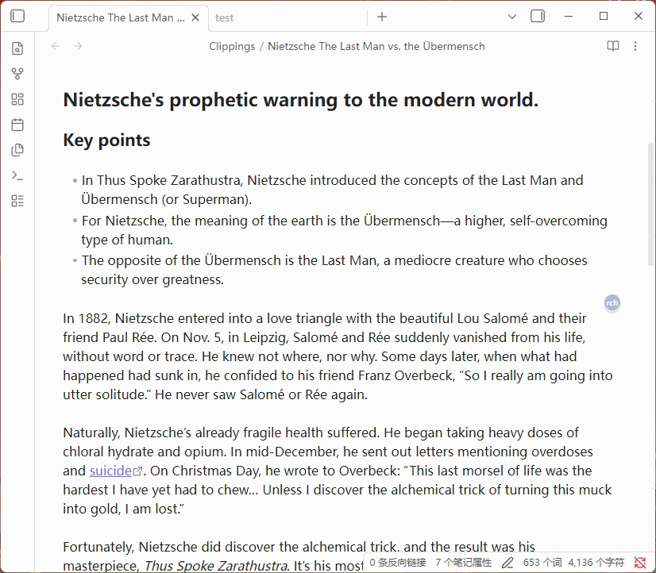

[中文](#Regex-CSS-Highlighter-zh) | English

---

# Regex CSS Highlighter
---
An Obsidian plugin that matches text via regular expressions and applies custom CSS styles for highlighting.

## Features

### 🎨 Style Highlighting

Style Highlighting

- Regex Matching + CSS Styles — Match text using regular expressions and apply custom CSS styles to matched content
- Style Category Management — Styles organized by groups, with support for adding, editing, and deleting
- Instant Style Application — Styles take effect immediately after adding/editing/deleting, no restart required
- Floating Style Buttons — Right-click a style button to create a draggable floating button with adjustable size and opacity
- Style Button Context Menu — Copy class name, copy full style, float display, and other quick actions

### 📝 Rule Management

Rule Management

- Current File / Global Rules — Support for both file-level and global rule scopes
- Rule Source Markers — Hover over matched text to see rule source (g=global/l=local), click to jump to the rule
- Highlight List — View all matched highlight rules in the current file, with per-column search and filtering
- Clipboard Merge — Merge clipboard content with selected text to add as a highlight rule

### 🔮 Floating Ball / Button

Floating Ball / Button

- Quick Access — Floating ball provides quick style application: left-click for current file rules, middle-click for global rules
- Group Submenu — Hover over a group option to expand a submenu showing all styles in that group
- Floating Option Buttons — Menu options can be pinned as independent floating buttons for instant access
- Show/Hide Text Styles — One-click toggle to show or hide all text style highlights

### 📱 Mobile Adaptation

Mobile Adaptation

- Touch Dragging — Floating ball and floating buttons support touch dragging for position adjustment
- Mobile Layout Settings — Line height and margins for mobile reading mode, independent from desktop
- Panel Opacity — Adjustable opacity for main panel and button panels on mobile
- Collapsible Filters — Highlight list filter panel collapsed by default on mobile to save screen space

### ✏️ Typography & Fonts

Typography & Fonts

- System Font Switching — Direct access to installed system fonts, no font files needed
- Font Favorites — Star favorite fonts to pin them to the top for quick access
- Line Height & Margins — Support for line height, left margin, and right margin settings, working in both edit and reading mode
- Scroll Wheel Adjustment — Numeric input fields support mouse wheel for quick value adjustment

### 📌 Notes

Notes

- Text Notes — Add notes to highlighted text with Markdown rendering support
- Image Support — Note popup supports uploading images and pasting from clipboard
- Table Rendering — Notes support Markdown tables with borders and zebra striping

### 🤖 AI Integration

AI Integration

- Multiple AI Configs — Support for multiple AI services (OpenAI, DeepSeek, etc.) with custom API endpoints and models
- AI Entity Extraction — Automatically identify entities in text using AI and batch add highlight rules

## Installation

Search for "Regex Css Highlighter" in Obsidian Settings → Community Plugins → Browse to install directly.

Manual Installation

1. Download `main.js` and `manifest.json`
2. Create a `Regex-Css-Highlighter` folder in your Obsidian vault's `.obsidian/plugins/` directory
3. Place the downloaded files in that folder
4. Enable "Regex Css Highlighter" in Obsidian Settings → Community Plugins

## Changelog

See [CHANGELOG.md](./CHANGELOG.md) for all version history.

---

中文 | [English](#Regex-CSS-Highlighter-en)

---

# Regex CSS Highlighter 中文
---
一个 Obsidian 插件，通过正则表达式匹配文本并应用自定义 CSS 样式高亮显示。

## 功能特性

### 🎨 样式高亮

样式高亮

- 正则匹配 + CSS 样式 — 使用正则表达式匹配文本，为匹配内容应用自定义 CSS 样式
- 样式分类管理 — 样式按分组分类，支持添加、编辑、删除样式
- 样式即时生效 — 添加/编辑/删除样式后无需重启，立即在笔记中生效
- 样式悬浮按钮 — 右键样式按钮可创建可拖动的悬浮按钮，支持调整大小和透明度
- 样式按钮右键菜单 — 复制类名、复制完整样式、悬浮显示等快捷操作

### 📝 规则管理

规则管理

- 当前文件规则 / 全局规则 — 支持文件级和全局级两种规则范围
- 规则来源标记 — 鼠标悬停匹配文本时显示规则来源（g=全局/l=局部），点击可跳转
- 高亮列表 — 查看当前文件中所有匹配的高亮规则，支持按列搜索、筛选
- 合并剪贴板 — 将剪贴板内容与选中文本合并添加为高亮规则

### 🔮 悬浮球

悬浮球

- 快速访问 — 悬浮球提供样式快速应用入口，左键应用当前文件规则，中键应用全局规则
- 分组子菜单 — 悬停分组选项展开子菜单，显示该分组所有样式
- 悬浮选项按钮 — 菜单选项可创建独立的悬浮按钮，随时可用
- 显示/隐藏文本样式 — 一键切换所有文本样式的显示与隐藏

### 📱 移动端适配

移动端适配

- 触摸拖动 — 悬浮球和悬浮按钮支持触摸拖动调整位置
- 独立排版设置 — 手机版阅读模式行距、边距独立于桌面版设置
- 面板透明度 — 手机版主面板和按钮面板支持透明度调整
- 折叠式筛选 — 高亮列表筛选区域默认收起，节省屏幕空间

### ✏️ 排版与字体

排版与字体

- 系统字体切换 — 直接读取系统已安装字体，无需放入字体文件
- 字体收藏 — 星标收藏常用字体，收藏字体置顶显示
- 行间距与边距 — 支持行间距、左边距、右边距设置，编辑和阅读模式均生效
- 滚轮微调 — 数值输入框支持鼠标滚轮快速调整

### 📌 备注功能

备注功能

- 文本备注 — 为高亮文本添加备注，支持 Markdown 渲染
- 图片支持 — 备注弹窗支持上传图片和粘贴剪贴板图片
- 表格渲染 — 备注支持 Markdown 表格，带边框和斑马纹样式

### 🤖 AI 集成

AI 集成

- 多 AI 配置 — 支持配置多个 AI 服务（OpenAI、DeepSeek 等），自定义 API 地址和模型
- AI 实体提取 — 使用 AI 自动识别文本中的实体并批量添加高亮规则

## 安装

在 Obsidian 设置 → 社区插件 → 浏览 中搜索 "Regex Css Highlighter" 直接安装。

手动安装

1. 下载 `main.js`、`manifest.json`
2. 在 Obsidian 库的 `.obsidian/plugins/` 目录下创建 `Regex-Css-Highlighter` 文件夹
3. 将下载的文件放入该文件夹
4. 在 Obsidian 设置 → 社区插件中启用 "Regex Css Highlighter"

## 更新日志

查看 [CHANGELOG.md](./CHANGELOG.md) 了解所有版本历史。
