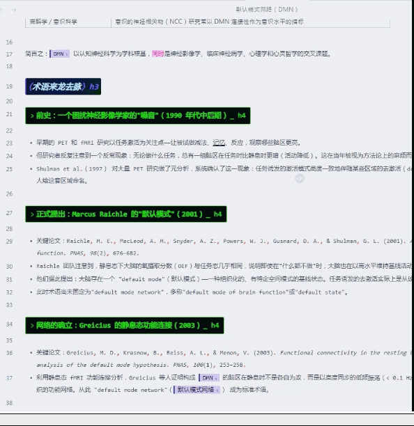
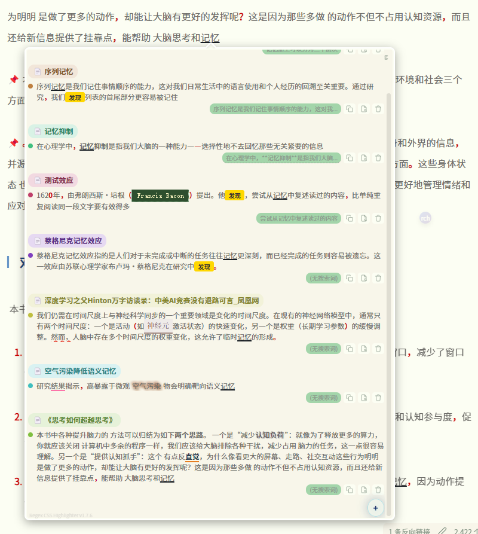

# Regex CSS Highlighter / 正则CSS高亮器

An Obsidian plugin that matches text via regular expressions and applies custom CSS styles for highlighting.
一个 Obsidian 插件，通过正则表达式匹配文本并应用自定义 CSS 样式高亮显示。

## Add Style / 添加样式

.gif)

.gif)

## Features / 功能特性

### 🎨 Style Highlighting / 样式高亮

Style Highlighting / 样式高亮

- Regex Matching + CSS Styles / 正则匹配 + CSS 样式 — Match text using regular expressions and apply custom CSS styles to matched content / 使用正则表达式匹配文本，为匹配内容应用自定义 CSS 样式
- Style Category Management / 样式分类管理 — Styles organized by groups, with support for adding, editing, and deleting / 样式按分组分类，支持添加、编辑、删除样式
- Instant Style Application / 样式即时生效 — Styles take effect immediately after adding/editing/deleting, no restart required / 添加/编辑/删除样式后无需重启，立即在笔记中生效
- Floating Style Buttons / 样式悬浮按钮 — Right-click a style button to create a draggable floating button with adjustable size and opacity / 右键样式按钮可创建可拖动的悬浮按钮，支持调整大小和透明度
- Style Button Context Menu / 样式按钮右键菜单 — Copy class name, copy full style, float display, and other quick actions / 复制类名、复制完整样式、悬浮显示等快捷操作

### 📝 Rule Management / 规则管理

Rule Management / 规则管理

- Current File / Global Rules / 当前文件规则 / 全局规则 — Support for both file-level and global rule scopes / 支持文件级和全局级两种规则范围
- Rule Source Markers / 规则来源标记 — Hover over matched text to see rule source (g=global/l=local), click to jump to the rule / 鼠标悬停匹配文本时显示规则来源（g=全局/l=局部），点击可跳转
- Highlight List / 高亮列表 — View all matched highlight rules in the current file, with per-column search and filtering / 查看当前文件中所有匹配的高亮规则，支持按列搜索、筛选
- Clipboard Merge / 合并剪贴板 — Merge clipboard content with selected text to add as a highlight rule / 将剪贴板内容与选中文本合并添加为高亮规则

### 🔮 Floating Ball / Button / 悬浮球

Floating Ball / Button / 悬浮球

- Quick Access / 快速访问 — Floating ball provides quick style application: left-click for current file rules, middle-click for global rules / 悬浮球提供样式快速应用入口，左键应用当前文件规则，中键应用全局规则
- Group Submenu / 分组子菜单 — Hover over a group option to expand a submenu showing all styles in that group / 悬停分组选项展开子菜单，显示该分组所有样式
- Floating Option Buttons / 悬浮选项按钮 — Menu options can be pinned as independent floating buttons for instant access / 菜单选项可创建独立的悬浮按钮，随时可用
- Show/Hide Text Styles / 显示/隐藏文本样式 — One-click toggle to show or hide all text style highlights / 一键切换所有文本样式的显示与隐藏

### 📱 Mobile Adaptation / 移动端适配

Mobile Adaptation / 移动端适配

- Touch Dragging / 触摸拖动 — Floating ball and floating buttons support touch dragging for position adjustment / 悬浮球和悬浮按钮支持触摸拖动调整位置
- Mobile Layout Settings / 独立排版设置 — Line height and margins for mobile reading mode, independent from desktop / 手机版阅读模式行距、边距独立于桌面版设置
- Panel Opacity / 面板透明度 — Adjustable opacity for main panel and button panels on mobile / 手机版主面板和按钮面板支持透明度调整
- Collapsible Filters / 折叠式筛选 — Highlight list filter panel collapsed by default on mobile to save screen space / 高亮列表筛选区域默认收起，节省屏幕空间

### ✏️ Typography & Fonts / 排版与字体

Typography & Fonts / 排版与字体

- System Font Switching / 系统字体切换 — Direct access to installed system fonts, no font files needed / 直接读取系统已安装字体，无需放入字体文件
- Font Favorites / 字体收藏 — Star favorite fonts to pin them to the top for quick access / 星标收藏常用字体，收藏字体置顶显示
- Line Height & Margins / 行间距与边距 — Support for line height, left margin, and right margin settings, working in both edit and reading mode / 支持行间距、左边距、右边距设置，编辑和阅读模式均生效
- Scroll Wheel Adjustment / 滚轮微调 — Numeric input fields support mouse wheel for quick value adjustment / 数值输入框支持鼠标滚轮快速调整

### 📌 Notes / 备注功能

Notes / 备注功能

- Text Notes / 文本备注 — Add notes to highlighted text with Markdown rendering support / 为高亮文本添加备注，支持 Markdown 渲染
- Image Support / 图片支持 — Note popup supports uploading images and pasting from clipboard / 备注弹窗支持上传图片和粘贴剪贴板图片
- Table Rendering / 表格渲染 — Notes support Markdown tables with borders and zebra striping / 备注支持 Markdown 表格，带边框和斑马纹样式

### 🤖 AI Integration / AI 集成

AI Integration / AI 集成

- Multiple AI Configs / 多 AI 配置 — Support for multiple AI services (OpenAI, DeepSeek, etc.) with custom API endpoints and models / 支持配置多个 AI 服务（OpenAI、DeepSeek 等），自定义 API 地址和模型
- AI Entity Extraction / AI 实体提取 — Automatically identify entities in text using AI and batch add highlight rules / 使用 AI 自动识别文本中的实体并批量添加高亮规则

## Share Your CSS Styles / 分享你的 CSS 样式

Created a cool style? Share it with the community in [Discussions](https://github.com/dlsdgj/obsidian-regex-css-highlighter/discussions/1) — see how others use regex and CSS to highlight their notes!
创建了好看的样式？在 [Discussions](https://github.com/dlsdgj/obsidian-regex-css-highlighter/discussions/1) 中与社区分享——看看其他人如何用正则和 CSS 高亮他们的笔记！

## Installation / 安装

Search for "Regex Css Highlighter" in Obsidian Settings → Community Plugins → Browse to install directly.
在 Obsidian 设置 → 社区插件 → 浏览 中搜索 "Regex Css Highlighter" 直接安装。

Manual Installation / 手动安装

1. Download `main.js` and `manifest.json` / 下载 `main.js`、`manifest.json`
2. Create a `Regex-Css-Highlighter` folder in your Obsidian vault's `.obsidian/plugins/` directory / 在 Obsidian 库的 `.obsidian/plugins/` 目录下创建 `Regex-Css-Highlighter` 文件夹
3. Place the downloaded files in that folder / 将下载的文件放入该文件夹
4. Enable "Regex Css Highlighter" in Obsidian Settings → Community Plugins / 在 Obsidian 设置 → 社区插件中启用 "Regex Css Highlighter"

## Changelog / 更新日志

Changelog / 更新日志

v1.7.6 (2026-06-17)

- **Plugin Startup Performance Optimization / 插件启动性能优化** — Cached `require('fs')`/`require('path')` at module level to eliminate repeated `require` calls; cached `styles.css` content to reduce 5 disk reads to 1; batched all `saveData()` calls in `onload()` from 10+ async writes to at most 1; parallelized independent async operations (`loadStyleCategories`, `loadGlobalRules`, `_preloadPinyinData`) with `Promise.all`; eliminated duplicate `style-categories.json` reads in `syncStylesToCategories`; deferred `cacheHoverStyles()` to lazy-load on first use instead of blocking startup; fixed `_preloadPinyinData()` being called twice / 将 `require('fs')`/`require('path')` 缓存至模块级别，消除重复 `require` 调用；缓存 `styles.css` 内容，将5次磁盘读取减少为1次；将 `onload()` 中的 `saveData()` 调用从10+次异步写入合并为最多1次；使用 `Promise.all` 并行化独立异步操作（`loadStyleCategories`、`loadGlobalRules`、`_preloadPinyinData`）；消除 `syncStylesToCategories` 中 `style-categories.json` 的重复读取；将 `cacheHoverStyles()` 延迟到首次使用时懒加载，不再阻塞启动；修复 `_preloadPinyinData()` 被重复调用的问题

v1.7.5 (2026-06-15)

- **Remark Popup File Name Sync Fix / 备注弹窗文件名同步修复** — Fixed file name in remark popup not updating after renaming a note; `handleFileRenameOrMove` now updates `links[].filePath` in all rules (current file, global, and other files) and persists changes to disk / 修复重命名笔记后备注弹窗中文件名不更新的问题；`handleFileRenameOrMove` 现在会更新所有规则（当前文件、全局、其他文件）中的 `links[].filePath` 并持久化到磁盘

v1.7.4 (2026-06-14)

- **Dark Mode Title Visibility Fix / 深色模式标题可见性修复** — Removed hardcoded `#555` color from "Single Display" and "Always Display" section titles, now uses default theme text color for proper visibility in dark mode / 移除"单显"和"常显"标题的 `#555` 硬编码颜色，现在使用默认主题文字颜色，深色模式下可正常显示
- **Single-display Tab Arrow Indicator / 单显标签箭头指示器** — Added a downward-pointing triangle arrow below the active single-display tab, visually connecting the tab to the content panel below / 在激活的单显标签下方添加向下的三角箭头，视觉上连接标签与下方内容面板

v1.7.3.1 (2026-06-14)

- **Release Asset Fix / Release 资源文件修复** — Fixed missing main.js and manifest.json in v1.7.2 GitHub release assets / 修复 v1.7.2 GitHub release 中缺少 main.js 和 manifest.json 的问题

v1.7.2 (2026-06-14)

- **Group Button Default Style / 分组按钮默认样式** — Changed group button default style from blue background with white text to white background with black text; custom styles now properly override the default / 分组按钮默认样式从蓝底白字改为白底黑字；自定义样式现在可正确覆盖默认样式
- **Single-display Tab Element Fix / 单显标签元素修复** — Changed single-display tab from `<button>` to `<h4>` element, fixing custom styles (gradient backgrounds, custom colors) not applying correctly / 单显标签从 `<button>` 改为 `<h4>` 元素，修复自定义样式（渐变背景、自定义颜色）无法正确应用的问题
- **Single-display Active State Persistence / 单显分组激活状态持久化** — Single-display group active state is now saved and restored when reopening the main panel / 单显分组的激活状态现在会被保存，重新打开主面板时自动恢复

v1.7.1 (2026-06-14)

- **Remark Badge Click Popup Fix / 备注徽章点击弹窗修复** — Fixed remark popup not appearing immediately when clicking the "n" badge to add a remark while hover delay is non-zero; popup now shows instantly and is protected from accidental mouseout cancellation / 修复悬浮延迟非0时点击"n"徽章添加备注弹窗不立即显示的问题；弹窗现在立即显示且不受鼠标移出意外取消
- **Default Settings for New Install / 新装插件默认设置** — New installs now default to: showRemarkBadge=true, remarkBadgeThreshold=2, popupLineHeight=1.5, popupBorderWidth=2, popupBorderColor=#ffffff / 新安装默认值：showRemarkBadge=true, remarkBadgeThreshold=2, popupLineHeight=1.5, popupBorderWidth=2, popupBorderColor=#ffffff

v1.7.0 (2026-06-10)

- **Mobile Context Menu Fix / 手机版右键菜单修复** — Fixed long-press style button options freezing, clicks not responding, and options remaining visible after closing the main panel on mobile / 修复长按样式按钮选项卡死、点击无反应、关闭主面板后选项仍显示的问题
- **Mobile Submenu Removal / 手机版移除子菜单** — Removed "Add as Heading Style" and "Move to Group" submenus on mobile (they rely on mouse hover events which don't work on touch devices) / 移除手机端"添加为标题样式"和"移动到分组"子菜单（依赖鼠标悬浮事件，手机无法操作）
- **Remark Popup Hover Delay / 备注弹窗悬浮延迟** — Added setting to control how long the mouse must hover over matched text before the remark popup appears; moving the mouse away before the delay cancels the popup, preventing accidental triggers / 新增设置项，控制鼠标悬浮多久后显示备注弹窗，鼠标提前离开则取消显示，防止意外触发
- **Add Group Instant Refresh / 添加分组即时刷新** — Fixed new groups not appearing in the main panel after adding; panel now refreshes immediately / 修复添加新分组后主面板不显示，需重新打开才显示的问题

v1.6.9 (2026-06-09)

- **Single-display Group Pin Button Fix / 单显分组📌按钮修复** — Changed single-display tab 📌 button from inline to absolute positioning (matching always-visible groups), removed overflow:hidden that was clipping the button / 单显标签📌按钮改为绝对定位（与常显分组一致），移除overflow:hidden裁切问题
- **Main Panel Dark Background Fix / 主面板暗色背景修复** — Injected !important CSS rule (.rch-transparent-bg) to forcefully override Obsidian's default modal-bg background, combined with MutationObserver for triple-layer protection / 注入!important CSS规则(.rch-transparent-bg)强制覆盖Obsidian默认modal-bg背景，配合MutationObserver三重保障
- **Main Panel Lock Improvement / 主面板锁定功能完善** — Lock button now directly sets pointer-events on modal-bg and modal-container to allow editor interaction when locked; fixed previously ineffective CSS class approach / 锁定按钮直接设置modal-bg和modal-container的pointer-events穿透，允许操作编辑器；修复之前无效的CSS class方案
- **Lock Focus Stealing Fix / 锁定焦点抢夺修复** — When locked, focusin events not triggered by user clicks on the panel are intercepted and focus is returned to the editor, preventing the panel from stealing focus / 锁定时拦截非用户点击触发的focusin事件，将焦点还给编辑器，防止面板抢夺焦点
- **Resize Handle Follows Panel / 调整大小按钮跟随面板** — Right-bottom resize handle now updates position in real-time when dragging the main panel / 拖动主面板时右下角调整大小按钮实时更新位置

v1.6.8 (2026-06-08)

- **Popup z-index Improvement / 弹窗层级优化** — Sub-modals (add group, rename, CSS editor, etc.) now appear above the main panel by raising their own z-index instead of lowering the main panel's, preventing Obsidian's sidebar divider from overlapping the panel / 子弹窗（添加分组、重命名、CSS编辑器等）现在通过提升自身z-index显示在主面板上方，而非降低主面板z-index，避免Obsidian侧边栏分割线覆盖主面板

v1.6.7 (2026-06-08)

- **Sticky Title Bar / 标题栏固定** — Main panel title bar now stays fixed at the top when scrolling content / 主面板滚动时标题栏固定在顶部不动
- **Scrollbar Position Fix / 滚动条位置修复** — Resizing the main panel no longer causes the scrollbar to jump to the left of the close button / 调整主面板大小时滚动条不再跳到关闭按钮左侧
- **Removed Display Settings / 移除显示设置** — Removed "Main Panel Opacity" and "Main Panel Width" settings from Display section; Ctrl+scroll and Alt+scroll shortcuts still work / 移除"显示"项下"主面板透明度"和"主面板宽度"设置，Ctrl+滚轮和Alt+滚轮快捷键仍可使用
- **Instant Group Toggle / 分组切换即时生效** — Toggling "Hide All Groups by Default" now immediately refreshes the panel instead of waiting for next open / 切换"默认隐藏所有分组"后立即刷新主面板，无需等待下次打开
- **Popup z-index Fix / 弹窗层级修复** — CSS editor and remark editor popups now correctly appear above the main panel / CSS编辑器和备注编辑弹窗不再被主面板遮挡
- **Cancel Button Optimization / 取消按钮优化** — Clicking "Cancel" in CSS editor no longer triggers unnecessary UI refresh / CSS编辑器点击"取消"不再触发不必要的UI刷新
- **Toggle Collapse Performance / 折叠展开性能** — Expand/collapse operations no longer wait for file save, eliminating 1.7s delay after CSS editor closes / 展开/折叠操作不再等待文件保存，消除CSS编辑器关闭后1.7秒延迟
- **Main Panel Open Speed / 主面板打开速度** — Deferred rendering of rules/settings sections, removed forced reflows, and batched font fixes for faster panel opening / 延迟渲染规则/设置区域，移除强制重排，批量字体修复，加快面板打开速度

v1.6.6 (2026-06-07)

- **Rule Conversion Merge / 规则转换合并** — When converting a rule between global and local, if a rule with the same regex already exists in the target, the cssClass is overwritten and remark/links are merged instead of blocking the conversion / 全局/局部规则转换时，若目标已存在同regex规则，cssClass覆盖、remark和links合并，不再阻止转换
- **Popup Rule Source Badge / 弹窗规则来源标记** — Added l/g (local/global) badge at the top-right corner of remark popup, always visible and clickable to convert rule source / 备注弹窗右上角添加l/g(局部/全局)按钮，始终置顶显示，点击可转换规则来源
- **Remark Popup i18n / 备注弹窗国际化** — Translated hardcoded Chinese strings in remark popup (double-click to edit, no search text, no title, copy/open/delete remark) for English mode support / 翻译备注弹窗中硬编码的中文文本（双击编辑备注、无搜索词、无标题、复制/打开/删除备注），支持英文模式
- **Updated Remark Demo GIF / 更新备注演示GIF** — Replaced addremark.gif with new demo animation / 替换为新的备注功能演示动画

v1.6.5 (2026-06-03)

- **Pseudo-element Style Support / 伪元素样式支持** — Add Style dialog now correctly previews and saves CSS rules with pseudo-elements (::before, ::after); pseudo-element rules are associated with their parent class / 添加样式窗口正确预览和保存含伪元素(::before, ::after)的CSS规则，伪元素规则关联到主类
- **@keyframes Animation Support / @keyframes 动画支持** — Add Style dialog now correctly previews and saves CSS rules with @keyframes animations; animation rules are placed below the main style rules; @keyframes blocks are stripped before class parsing to prevent false matches from decimal values inside keyframe definitions / 添加样式窗口正确预览和保存含 @keyframes 动画的CSS规则，动画规则放在样式规则下方；解析前移除 @keyframes 块避免内部小数被误匹配为类选择器
- **Remove Highlight Regex Matching Fix / 移除高亮正则匹配修复** — Fixed bug where rules containing regex escape characters (e.g. `\\.`) could not be matched when removing highlights by selecting text; replaced direct string comparison with regex matching via `textMatchesRegex()` helper function / 修复含正则转义字符(如 `\\.`)的规则无法通过选中文本移除高亮的问题，改用 `textMatchesRegex()` 辅助函数进行正则匹配
- **Remove Preview Checkboxes / 移除预览复选框** — Removed checkboxes from style preview in Add Style dialog; clicking "Add Style" now adds all parsed styles by default / 添加样式窗口移除预览前的复选框，点击"添加样式"默认添加全部解析到的样式
- **README Add Style Demo / README 添加样式演示** — Added "Add Style" and "AI Create Style" demo GIFs to README in both English and Chinese sections / 在 README 中英文部分新增"添加样式"和"AI创建样式"演示 GIF

v1.6.4 (2026-06-03)

- **Main Panel Group Button Style Customization / 主面板分组按钮样式自定义** — Added right-click context menu option to edit group button style class; supports custom CSS class preview and application / 右键菜单添加"修改分组样式"选项，可自定义分组按钮的CSS样式类，支持预览和应用
- **Dark Mode Title Text Visibility Fix / 深色模式标题文字可见性修复** — Removed custom text colors from panel titles, style list/group labels, and settings text; now uses default theme colors for proper dark mode support / 移除主面板标题、样式列表/分组、设置等文字的自定义颜色，使用默认主题色，确保深色模式正常显示
- **Pin Submenu Button Repositioned / "固定子菜单"按钮位置调整** — Moved "Pin Submenu" button to top-left corner of submenus to avoid blocking style buttons / 移动到子菜单左上角，避免遮挡样式按钮
- **Submenu Direction Adaptation / 子菜单方向适配** — Floating group submenus now open to the left when the group is on the right side of the screen, preventing overlap with group buttons on mobile / 悬浮分组在右侧时子菜单向左展开，避免覆盖分组按钮
- **Mobile Horizontal Scroll Fix / 手机端横向滚动修复** — Mobile now limits modal width to screen width even when desktop saved a larger modalWidth value; prevents horizontal overflow caused by cross-device settings sync / 手机端限制modalWidth不超过屏幕宽度，解决桌面端保存的大宽度值导致手机端溢出

v1.6.3 (2026-06-02)

- **Fixed Callout Highlight Not Showing in Edit Mode / 修复编辑模式Callout高亮不显示** — Added `applyHighlightsToLivePreviewCallouts` method to apply DOM-based highlighting to callout widgets in live preview mode; ViewPlugin's update now schedules callout highlight via debounced `requestAnimationFrame`; scroll and layout-change events also trigger callout highlighting in source mode / 添加 `applyHighlightsToLivePreviewCallouts` 方法，对实时预览中的callout组件应用DOM高亮；ViewPlugin更新时通过防抖 `requestAnimationFrame` 调度callout高亮；滚动和布局变化事件也会触发callout高亮
- **Fixed Overlapping Decoration Ranges / 修复装饰范围重叠** — Improved range sorting with secondary `to` key; added validation filter for invalid ranges; switched to `Decoration.set(validRanges, true)` to enable CodeMirror's internal sorting for safer handling of overlapping decorations from multiple rules / 改进范围排序，增加 `to` 作为次要排序键；添加无效范围过滤；使用 `Decoration.set(validRanges, true)` 启用CodeMirror内部排序，更安全地处理多规则重叠装饰
- **Added Remark Demo GIF / 添加备注演示GIF** — Added `addremark.gif` to assets folder and referenced it in both English and Chinese Notes/备注功能 sections of README.md / 在assets文件夹添加 `addremark.gif`，并在README中英文备注功能部分引用

v1.6.2 (2026-06-02)

- **Custom Default Preview Text / 自定义默认预览文本** — Added "Default Preview Text" setting in Display section with separate Chinese/English input fields; when no text is selected, style buttons show custom text instead of default "示例"/"Preview" / 在显示设置中添加"默认预览文本"设置，支持中英文分别输入；未选中文本时样式按钮显示自定义文本
- **Fixed Clickable Title Text for Rules Sections / 修复规则标题文字点击问题** — Clicking "Current File Rules" and "Global Rules" title text now correctly triggers expand/collapse; added pointer-events:none to h3 and description elements to ensure click events bubble properly / 点击"当前文件规则"和"全局规则"标题文字现在正确触发展开/折叠；添加pointer-events:none确保点击事件正确冒泡
- **Highlight List Search No Data Fix / 高亮列表搜索无数据修复** — When column filters match no results, table header with search inputs is now preserved instead of being cleared; "No data" message appears in tbody while search remains functional / 列筛选无结果时保留表头搜索框，"无数据"提示显示在tbody中，搜索功能仍可用
- **Visible Column Resizer / 列调整手柄可见** — Column resize handles in highlight list are now always visible with a subtle border color; hover highlights in accent color / 高亮列表列调整手柄始终可见，悬停时高亮显示
- **Fixed Column Resize Affecting Other Columns / 修复列调整影响其他列** — Dragging a column resizer now only adjusts the current column and its right neighbor (one grows, one shrinks); other columns remain unaffected / 拖动列调整手柄只调整当前列和右侧相邻列，其他列不受影响
- **Smooth Column Resizing / 流畅列调整** — Cached table width on mousedown instead of reading DOM on every mousemove; eliminated layout thrashing for smooth drag experience / mousedown时缓存表格宽度，避免每次mousemove读取DOM，消除布局抖动
- **Highlight List Performance Optimization / 高亮列表性能优化** — Used DocumentFragment for batch DOM construction; replaced per-row event listeners with event delegation on tbody; eliminated duplicate filter computation in stats display / 使用DocumentFragment批量构建DOM；事件委托替代逐行监听；消除重复筛选计算

v1.6.1 (2026-06-02)

- **Remark Badge Indicator / 备注标记指示器** — Added "Show remark indicator at top-right of highlighted text" setting under Remark Popup section; hovering highlighted text shows a small "n" badge, clicking it opens the Add Remark modal; includes character threshold option / 在备注弹窗设置中添加"在高亮文本右上角显示备注指示器"；悬停高亮文本显示小"n"标记，点击打开添加备注弹窗；支持字数阈值选项
- **Long Phrase Priority Matching / 长词组优先匹配** — When merging rules (e.g. "视角主义" + "视角主义真理观"), longer phrases now match first; added sortRegexByLength utility function applied to all regex matching logic / 合并规则时（如"视角主义"+"视角主义真理观"），更长的词组优先匹配；添加sortRegexByLength工具函数应用于所有正则匹配逻辑
- **Fixed Remark Popup in Edit Mode Callouts / 修复编辑模式Callout中备注弹窗** — Remark popup now works correctly in CodeMirror edit mode for text inside callouts; changed from classList.contains to closest() for upward DOM traversal / 备注弹窗在CodeMirror编辑模式中正确处理callout内文本；改用closest()向上遍历DOM
- **Remark Popup Setting Name Fix / 备注弹窗设置名称修复** — Renamed "确认后不自动关闭" to "鼠标离开不自动关闭"; remark popup now auto-closes after clicking confirm / "确认后不自动关闭"改为"鼠标离开不自动关闭"；点击确认后自动关闭备注弹窗
- **Global Highlight Rules Scrollbar / 全局高亮规则滚动条** — Added scrollbar to global highlight rules section when content exceeds viewport height / 全局高亮规则区域内容超出视口高度时添加滚动条
- **Hide Open File Links Setting / 隐藏打开文件链接设置** — Added "Don't show open file links after panel titles" setting in Display section; controls visibility of "Open styles.css", "Open group file", "Open data.json" links / 在显示设置中添加"不显示标题后面的打开文件链接"；控制"打开styles.css"、"打开分组文件"、"打开data.json"链接的可见性
- **Localized Default Group Name / 本地化默认分组名称** — Default group name for new styles now follows plugin language (e.g. "New Group" in English mode) / 新样式的默认分组名称跟随插件语言（如英文模式下为"New Group"）
- **Floating Element Initial Position / 悬浮元素初始位置** — First-time hover on options/groups/style buttons now positions near the mouse cursor / 首次悬停选项/分组/样式按钮时在鼠标附近定位
- **Language Switch Instant Refresh / 语言切换即时刷新** — Switching language now immediately refreshes the panel without needing to reopen / 切换语言后立即刷新面板，无需重新打开
- **Fixed Arrow Position After Style Edit / 修复样式编辑后箭头位置** — Arrow indicator now stays inside the group style area after editing custom styles / 编辑自定义样式后箭头指示器保持在分组样式区域内
- **Floating Group Button Positioning / 悬浮分组按钮定位** — Each floating group button appears near the mouse cursor with top-right corner aligned to mouse position; position info cleared on close / 每个悬浮分组按钮在鼠标附近出现，右上角对齐鼠标位置；关闭时清除位置信息
- **Full-Width Clickable Panel Titles / 全宽可点击面板标题** — "Settings", "Current File Rules", "Global Rules" titles now have full-width clickable area and background shading for expand/collapse / "设置"、"当前文件规则"、"全局规则"标题具有全宽可点击区域和背景着色

v1.6.0 (2026-06-01)

- **Floating Group No Longer Auto-Added to Floating Ball Menu / 悬浮分组不再自动添加到悬浮球菜单** — Floating a group via main panel group title hover button or right-click "Float This Group" now only creates floating buttons without automatically adding the group to the floating ball menu; users can manually add groups in the floating ball menu settings / 通过主面板分组标题悬停按钮或右键"悬浮此分组"创建悬浮按钮时，不再自动将分组添加到悬浮球菜单；用户可在悬浮球菜单设置中手动添加

v1.5.9 (2026-06-01)

- **Default Language Changed to English / 默认语言改为英文** — New installations now default to English; Chinese users can switch via CN/EN button / 新安装默认使用英文；中文用户可通过CN/EN按钮切换
- **Floating Ball Options Simplified / 悬浮球选项简化** — Format Replace, Ruby, AI Reply, Entity Extract, Font Switch, Mode Switch, Hide Floating Buttons, Show/Hide Text Styles are unchecked by default for new installations / 格式替换、注音、AI回复、实体提取、字体切换、模式切换、隐藏悬浮按钮、显示/隐藏文本样式在新安装中默认不勾选
- **Heading Styles Disabled by Default / 标题样式默认禁用** — New installations have heading styles disabled to reduce visual clutter / 新安装默认禁用标题样式以减少视觉杂乱
- **Floating Ball Menu Position Fix / 悬浮球菜单位置修复** — Menu now appears on the left side when floating ball is on the right half of the screen, avoiding overlap / 悬浮球在屏幕右半部分时菜单出现在左侧，避免重叠
- **English Menu Text Wrapping Fix / 英文菜单文字换行修复** — Increased menu width and added nowrap to prevent English option text from wrapping to two lines / 增加菜单宽度并添加nowrap，防止英文选项文字换行
- **Plugin Market Support / 插件市场支持** — Added versions.json for Obsidian plugin market compatibility; install directly by searching "Regex Css Highlighter" / 添加versions.json以兼容Obsidian插件市场；直接搜索"Regex Css Highlighter"安装
- **README Updated / README更新** — Added demo GIFs, plugin market install instructions, removed keyboard shortcuts section, manual install moved to collapsible section / 添加演示GIF、插件市场安装说明，移除快捷键部分，手动安装移至折叠区域
- **Changelog Migrated to CHANGELOG.md / 更新日志迁移至CHANGELOG.md** — Version history moved from README.md to standalone CHANGELOG.md file / 版本历史从README.md迁移到独立的CHANGELOG.md文件

v1.5.8 (2026-06-01)

- **Removed "About" Section / 移除"关于"部分** — Removed "About" section from bottom of main panel; version changelog migrated to CHANGELOG.md / 从主面板底部移除"关于"部分；版本更新日志迁移至CHANGELOG.md
- **Cleaned Up Donation Code / 清理捐赠代码** — Removed showDonateImage class methods and standalone functions, setupDonateText function, donation button CSS styles, and related translation keys / 移除showDonateImage类方法和独立函数、setupDonateText函数、捐赠按钮CSS样式及相关翻译键
- **Cleaned Up Unused Translation Keys / 清理未使用的翻译键** — Removed main.tab.about, settings.about, settings.updateHistory, settings.viewUpdates and other unused translation keys / 移除main.tab.about、settings.about、settings.updateHistory、settings.viewUpdates等未使用的翻译键
- **Removed DONATE_QR_CODE Constant / 移除DONATE_QR_CODE常量** — Removed base64-encoded donation QR code image constant / 移除base64编码的捐赠二维码图片常量

v1.5.7 (2026-05-31)

- **Internationalization Support / 国际化支持** — Added CN/EN language switch button in main panel, supports switching between Chinese and English interfaces / 在主面板添加CN/EN语言切换按钮，支持中英文界面切换
- **Full i18n Coverage / 完整i18n覆盖** — All UI text including settings titles, floating ball options, and group style buttons fully internationalized / 所有UI文本包括设置标题、悬浮球选项、分组样式按钮完全国际化
- **"Show/Hide Text Styles" Floating Ball Management / "显示/隐藏文本样式"悬浮球管理** — Added option to control whether this feature appears in the floating ball menu / 添加选项控制此功能是否出现在悬浮球菜单中
- **Fixed Group Submenu Middle-click Auto-scroll / 修复分组子菜单中键自动滚动** — Middle-clicking to add global rule no longer triggers auto-scroll state / 中键添加全局规则不再触发自动滚动状态
- **Highlight List Style Name Column / 高亮列表样式名称列** — Added style name column to highlight list; display text shown on separate line when present; visibility toggleable / 高亮列表添加样式名称列；存在显示文本时单独一行显示；可切换可见性
- **Per-column Title Search / 按列标题搜索** — Added search box to each header, placeholder shows header text, supports real-time per-column filtering / 每个表头添加搜索框，占位符显示表头文本，支持实时按列筛选
- **Removed "Add to Highlight List" Feature / 移除"添加到高亮列表"功能** — Removed style button right-click "Add to Highlight List" option and highlight list filters: show style name, filter by style name / 移除样式按钮右键"添加到高亮列表"选项和高亮列表筛选器：显示样式名称、按样式名称筛选
- **Minimum Count Always Visible / 最少次数始终可见** — Removed mode dropdown; minimum count input always visible; Chinese label changed to "样式最少被应用 [X] 次" / 移除模式下拉框；最少次数输入框始终可见；中文标签改为"样式最少被应用 [X] 次"

v1.5.6 (2026-05-31)

- **Floating Submenu Right-click Options / 悬浮子菜单右键选项** — Added "Edit Display Text", "Copy Class Name", "Copy Full Style" options to floating group submenu style right-click menu / 悬浮分组子菜单样式右键菜单添加"修改显示文本"、"复制类名"、"复制完整样式"选项
- **Submenu Right-click Interaction Fix / 子菜单右键交互修复** — Fixed issue where submenu would hide when mouse moved to right-click menu options / 修复鼠标移动到右键菜单选项时子菜单会隐藏的问题
- **Middle-click Add Global Rule / 中键添加全局规则** — Middle-clicking a style in floating group submenu adds selected text as global rule / 悬浮分组子菜单样式中键点击将选中文本添加为全局规则
- **Rule Source Marker (g/l) / 规则来源标记(g/l)** — Hovering matched rule text shows global/local marker "g/l", click to jump to corresponding rule; supports character threshold setting / 悬停匹配规则文本显示全局/局部标记"g/l"，点击跳转到对应规则；支持字数阈值设置
- **Edit Mode Marker Fix / 编辑模式标记修复** — Fixed bug where "g/l" marker was added as text content in edit mode / 修复编辑模式中"g/l"标记被添加为文本内容的bug
- **Floating Submenu Class Name Tooltip / 悬浮子菜单类名提示** — Hovering floating group submenu style item shows class name tooltip / 悬停悬浮分组子菜单样式项显示类名提示
- **Text Style Show/Hide / 文本样式显示/隐藏** — Added "Show Text Styles"/"Hide Text Styles" option to floating ball hover menu; when hidden, all text style matches are hidden / 悬浮球悬停菜单添加"显示文本样式"/"隐藏文本样式"选项；隐藏时隐藏所有文本样式匹配

v1.5.5 (2026-05-29)

- **Hidden Position Data Retention / 隐藏位置数据保留** — Position data saved when hiding floating style buttons; automatically restored to original position when shown again / 隐藏悬浮样式按钮时保存位置数据；下次显示时自动恢复到原位置
- **Main Panel Floating Display Button / 主面板悬浮显示按钮** — 📌 button appears on hover over main panel style buttons; click to float display that style / 主面板样式按钮悬停时出现📌按钮；点击悬浮显示该样式

v1.5.4 (2026-05-28)

- **Clean Non-existent Styles / 清理不存在的样式** — Added "Clean non-existent styles in category file" function in Settings→Display; scans and removes styles that exist in style-categories.json but are missing from styles.css / 在设置→显示中添加"清理分类文件中不存在的样式"功能；扫描并移除style-categories.json中存在但styles.css中缺失的样式
- **Group Submenu Scrollbar / 分组子菜单滚动条** — Added scrollbar to floating ball menu and floating option button group style submenus; prevents overflow when there are too many styles / 悬浮球菜单和悬浮选项按钮分组样式子菜单添加滚动条；防止样式过多时溢出
- **Settings Title Light Blue Background / 设置标题浅蓝背景** — Added light blue background to all level titles in main panel settings for better visual hierarchy / 主面板设置中所有级别标题添加浅蓝背景，更好的视觉层次

v1.5.3 (2026-05-27)

- **Mobile Reading Mode Line Height / 手机阅读模式行高** — Added line height setting in mobile "Display" settings; merged with margin settings as "Mobile Reading Mode Line Height/Margin" / 在手机"显示"设置中添加行高设置；与边距设置合并为"手机阅读模式行距/边距"
- **Mobile Panel Opacity / 手机面板透明度** — Added main panel and button panel opacity settings in mobile "Display" settings / 在手机"显示"设置中添加主面板和按钮面板透明度设置
- **Mobile Layout Settings Separation / 手机排版设置分离** — Mobile no longer applies desktop line height and margin settings; controlled by mobile-specific settings / 手机不再应用桌面行高和边距设置；由手机专用设置控制
- **Mobile Auto-expand Fix / 手机自动展开修复** — Fixed bug where first style was incorrectly applied to text in mobile auto-expand mode / 修复手机自动展开模式下第一个样式被错误应用到文本的bug
- **Title Settings Categorization / 标题设置分类** — Moved "Heading Level Label" and "Disable Heading Styles" to new "Title" settings category / 将"标题级别标签"和"禁用标题样式"移至新建的"标题"设置分类
- **Count Info Fix / 计数信息修复** — Fixed bug where "Style Categories" and "File Count" count info were not displayed on the same line; removed link styles / 修复"样式分类"和"文件计数"计数信息不在同一行显示的bug；移除链接样式
- **Floating Ball Menu Opacity / 悬浮球菜单透明度** — Floating ball menu supports Ctrl+scroll to adjust opacity; retained after restart / 悬浮球菜单支持Ctrl+滚轮调整透明度；重启后保留
- **Right-click Menu Improvements / 右键菜单改进** — Right-clicking another style auto-closes previous menu; normal mode right-click menu adds "Move to Group" option / 右键另一个样式时自动关闭上一个菜单；普通模式右键菜单添加"移至分组"选项

v1.5.2 (2026-05-26)

- **Settings Outline Reorganization / 设置大纲重组** — Changed settings from flat separator format to outline-style indented collapse/expand for better visual hierarchy / 将设置从平面分隔线格式改为大纲式缩进折叠展开，更好的视觉层次
- **Show Recent Rules When Collapsed / 折叠时显示最近规则** — Added setting to control whether recently added rules are shown when main panel opens with no selected text and highlight rules collapsed / 添加设置控制主面板打开时无选中文本且高亮规则折叠时是否显示最近添加的规则
- **Mobile Hide Font Switch / 手机端隐藏字体切换** — Hide font switch feature area on mobile devices / 在手机设备上隐藏字体切换功能区域
- **Mobile Hide Open File Links / 手机端隐藏打开文件链接** — Hide "Open data.json file" link next to "Settings" title on mobile / 在手机端隐藏"设置"标题旁边的打开data.json文件链接

v1.5.1 (2026-05-25)

- **Typography Settings / 排版设置** — Added line height, left margin, right margin settings in "Switch Body Font" popup; works in both edit and reading mode / 在"切换正文字体"弹窗中添加行高、左边距、右边距设置；编辑和阅读模式均生效
- **Scroll Wheel Value Adjustment / 滚轮数值调整** — Line height and margin input boxes support mouse wheel quick adjustment / 行高和边距输入框支持鼠标滚轮快速调整
- **Edit Mode Margin Fix / 编辑模式边距修复** — Fixed issue where left and right margins didn't work in edit mode / 修复编辑模式中左右边距不生效的问题

v1.5.0 (2026-05-25)

- **Disable Heading Styles / 禁用标题样式** — Added "Disable Heading Styles" toggle in settings; when disabled, custom heading styles are not applied but heading level labels are retained; "Heading Styles" section hidden in main panel when disabled / 在设置中添加"禁用标题样式"开关；禁用时不应用自定义标题样式但保留标题级别标签；禁用时主面板隐藏"标题样式"区域
- **Level Label Gradient Text Compatibility / 级别标签兼容渐变文字** — Fixed issue where level labels were invisible when using gradient text CSS snippets; reset inherited transparent text and background-clip properties in pseudo-elements / 修复使用渐变文字CSS片段时级别标签不可见的问题；在伪元素中重置继承的透明文字和background-clip属性
- **Remove Usage Instructions / 移除使用说明** — Removed "Usage Instructions" content from main panel for cleaner interface / 从主面板移除"使用说明"内容，界面更简洁

v1.4.9 (2026-05-25)

- **Instant Style Application / 样式即时生效** — Fixed issue where styles required Obsidian restart to display after adding/editing/deleting; new styles now take effect immediately / 修复添加/编辑/删除样式后需要重启Obsidian才能显示的问题；新样式现在立即生效
- **Style Refresh Mechanism Optimization / 样式刷新机制优化** — Removed destructive forceStyleRefresh calls to avoid clearing newly injected CSS; after writing CSS file, directly update dynamic style element without re-reading / 移除破坏性的forceStyleRefresh调用，避免清除新注入的CSS；写入CSS文件后直接更新动态样式元素，无需重新读取
- **CSS Read/Write Consistency Fix / CSS读写一致性修复** — Changed injectCSSContent to use vault.adapter.read for consistency with write API, avoiding cache desync / 将injectCSSContent改为使用vault.adapter.read以与写入API一致，避免缓存不同步
- **Popup Refresh Acceleration / 弹窗刷新加速** — Removed multi-layer setTimeout delays (500ms+200ms) after adding styles; popup refreshes immediately / 移除添加样式后的多层setTimeout延迟（500ms+200ms）；弹窗即时刷新
- **Delete Style Instant Refresh / 删除样式即时刷新** — Removed 1-second delay after deleting style; immediately re-injects CSS and refreshes view / 移除删除样式后的1秒延迟；立即重新注入CSS并刷新视图

v1.4.7 (2026-05-24)

- **System Font Switching / 系统字体切换** — Font switching now directly reads system installed fonts, no font files needed; eliminates CSP/OTS compatibility issues / 字体切换现在直接读取系统已安装字体，无需字体文件；消除CSP/OTS兼容性问题
- **Font Favorites / 字体收藏功能** — Font list supports star favorites; favorite fonts pinned to top / 字体列表支持星标收藏；收藏字体置顶显示
- **Font Search / 字体搜索** — Added search box in font selection popup for quick filtering and locating fonts / 在字体选择弹窗中添加搜索框，快速筛选和定位字体
- **Font List Style / 字体列表样式** — Card layout, SVG star icon, "In Use" label, hover interaction optimization / 卡片式布局、SVG星标图标、"使用中"标签、悬停交互优化

v1.4.6 (2026-05-22)

- **DeepSeek Default Config Update / DeepSeek默认配置更新** — New install DeepSeek default base_url changed to https://api.deepseek.com/chat/completions, model changed to deepseek-v4-flash / 新安装插件时DeepSeek默认base_url改为 https://api.deepseek.com/chat/completions ，模型改为 deepseek-v4-flash
- **Style Class Name Tooltip / 样式类名提示** — Added tooltip in edit floating option window's style class name input: "Long-press/right-click main panel style button → Copy Class Name" / 在编辑悬浮选项窗口的样式类名输入框添加提示："长按/右键主面板样式按钮 → 复制类名"

v1.4.5 (2026-05-22)

- **Floating Ball Remove Highlight / 悬浮球移除高亮** — Added "Remove Highlight" option to floating ball; after selecting highlighted text, click to remove corresponding rule; supports smart multi-part rule splitting / 悬浮球添加"移除高亮"选项；选中高亮文本后点击移除对应规则；支持智能多部分规则拆分
- **Rule Right-click Menu Enhancement / 规则右键菜单增强** — Current file rules and global rules buttons right-click menu adds "Delete Rule" and "Move to Global/Current File Rules" options / 当前文件规则和全局规则按钮右键菜单添加"删除规则"和"移至全局/当前文件规则"选项
- **Reading Mode Selected Text Fix / 阅读模式选中文本修复** — Fixed issue where opening main panel after selecting text in reading mode couldn't get selected text; selection saved before popup opens / 修复阅读模式选中文本后打开主面板无法获取选中文本的问题；在弹窗打开前保存选区
- **Floating Option Arrow Fix / 悬浮选项箭头修复** — Fixed issue where two arrows appeared on floating option button after editing style; arrow moved inside style area to save space / 修复编辑样式后悬浮选项按钮出现两个箭头的问题；箭头移至样式区域内节省空间
- **Mobile Main Panel Optimization / 手机主面板优化** — Mobile hides opacity/width controls and title hint info/links; regex label displayed on separate line / 手机端隐藏透明度/宽度控件和标题提示信息/链接；正则表达式标签单独一行显示
- **Remove Add Remark Button / 移除添加备注按钮** — Removed "Add Remark" button from main panel; remark feature still accessible via right-click menu and floating ball / 从主面板移除"添加备注"按钮；备注功能仍可通过右键菜单和悬浮球访问

v1.4.4 (2026-05-22)

- **Floating Button Scale Offset Fix / 悬浮按钮缩放偏移修复** — Fixed bug where clicking floating style button after Alt+scroll scale adjustment would move left/right / 修复Alt+滚轮缩放调整后点击悬浮样式按钮会左右移动的bug
- **About Panel Height Fix / 关于面板高度修复** — "About" section height changed from fixed 300px to 70vh adaptive to window height / "关于"部分高度从固定300px改为70vh自适应窗口高度
- **Copy Class Name / 复制类名功能** — Added "Copy Class Name" option to style button right-click menu; one-click copy CSS class name to clipboard / 样式按钮右键菜单添加"复制类名"选项；一键复制CSS类名到剪贴板

v1.4.3 (2026-05-22)

- **Reading Mode Cross-element Highlight / 阅读模式跨元素高亮** — Rewrote highlight matching logic to support matching long text crossing DOM element boundaries; resolves issue where text with existing highlights or global rule modifiers couldn't have new styles applied / 重写高亮匹配逻辑，支持匹配跨DOM元素边界的长文本；解决已有高亮或全局规则修饰符的文本无法应用新样式的问题
- **Right-click Menu Overflow Fix / 右键菜单溢出修复** — Floating option button and floating style button right-click menus auto-adjust position at screen right/bottom edges; no longer overflow screen / 悬浮选项按钮和悬浮样式按钮右键菜单在屏幕右/底部边缘时自动调整位置；不再溢出屏幕

v1.4.2 (2026-05-21)

- **Mobile Floating Style Button Drag / 手机悬浮样式按钮拖动** — Fixed issue where restored floating style buttons couldn't be dragged to adjust position on mobile / 修复恢复的悬浮样式按钮在手机上无法拖动调整位置的问题
- **Touch Drag Misoperation Prevention / 触摸拖动防误操作** — Floating style button touch drag no longer accidentally triggers style application / 悬浮样式按钮触摸拖动不再误触发样式应用

v1.4.1 (2026-05-21)

- **Floating Option Right-click Menu / 悬浮选项右键菜单** — Floating option button right-click changed to popup menu (edit/close); no longer directly closes / 悬浮选项按钮右键改为弹出菜单（编辑/关闭）；不再直接关闭
- **Floating Option Edit Function / 悬浮选项编辑功能** — Right-click "Edit" can modify display text and style class name; style class name supports full pseudo-element rendering / 右键"编辑"可修改显示文本和样式类名；样式类名支持完整伪元素渲染
- **Floating Option Scroll Wheel Adjustment / 悬浮选项滚轮调整** — Alt+scroll adjusts size, Ctrl+scroll adjusts opacity; retained after restart / Alt+滚轮调整大小，Ctrl+滚轮调整透明度；重启后保留
- **Floating Style Button Edit Name / 悬浮样式按钮编辑名称** — Added "Edit Name" option to floating style button right-click menu; can modify display text / 悬浮样式按钮右键菜单添加"编辑名称"选项；可修改显示文本
- **Style Class Name Rendering Optimization / 样式类名渲染优化** — Removed default border after setting style class name; fully injects CSS rules including pseudo-elements; supports complex styles / 设置样式类名后移除默认边框；完整注入CSS规则包括伪元素；支持复杂样式

v1.4.0 (2026-05-21)

- **Mobile Floating Ball Adaptation / 手机悬浮球适配** — Enlarged floating ball size to 36px, adjusted default position, added position safety check to ensure visibility / 增大悬浮球尺寸至36px，调整默认位置，添加位置安全检查确保可见
- **Mobile Floating Ball Menu / 手机悬浮球菜单** — Clicking floating ball pops up options menu instead of direct highlight; distinguishes from desktop behavior / 点击悬浮球弹出选项菜单而非直接高亮；与桌面行为区分
- **Mobile Floating Button Drag / 手机悬浮按钮拖动** — Added touch event support to floating style buttons and floating option buttons; draggable to adjust position / 悬浮样式按钮和悬浮选项按钮添加触摸事件支持；可拖动调整位置
- **Mobile Reading Mode Line Height/Margin / 手机阅读模式行距/边距** — Added mobile reading mode line height and left/right margin settings; moved to "Display" category; separated from desktop typography settings / 添加手机阅读模式行高和左右边距设置；移至"显示"分类；与桌面排版设置分离
- **Mobile Collapsible Filter Panel / 手机折叠式筛选面板** — Highlight list filter area changed to collapsible panel; collapsed by default, click to expand / 高亮列表筛选区域改为折叠面板；默认收起，点击展开
- **Mobile List-style Highlight Display / 手机列表式高亮显示** — Mobile highlight list changed to card layout; remarks collapsed into highlight text, click to expand / 手机端高亮列表改为卡片式布局；备注折叠到高亮文本中，点击展开
- **Highlight List Performance Optimization / 高亮列表性能优化** — Parallelized file reads, memory cache priority, eliminated redundant exists calls, global rule Map index / 并行化文件读取、内存缓存优先、消除冗余exists调用、全局规则Map索引
- **Loading State Indicator / 加载状态指示器** — Shows "Loading..." indicator when highlight list opens and filter toggles; renders UI first then loads data / 高亮列表打开和筛选切换时显示"加载中..."指示器；先渲染UI再加载数据

v1.3.9 (2026-05-20)

- **Mobile Compatibility / 手机兼容性** — Encapsulated cross-platform file operation utility class; desktop uses Node.js fs module (high performance), mobile uses Vault Adapter (compatibility) / 封装跨平台文件操作工具类；桌面使用Node.js fs模块（高性能），手机使用Vault Adapter（兼容性）
- **Reading Mode Scroll Highlight / 阅读模式滚动高亮** — Fixed issue where highlights were lost after scrolling; added scroll event listener to automatically re-apply highlights within viewport / 修复滚动后高亮丢失的问题；添加滚动事件监听器自动重新应用视口内高亮
- **Deferred Processing Race Condition Fix / 延迟处理竞态条件修复** — Fixed timer race condition in PostProcessor deferred batching / 修复PostProcessor延迟批处理中的定时器竞态条件

v1.3.8 (2026-05-14)

- **Reading Mode Highlight Fix / 阅读模式高亮修复** — Fixed issue where some matched text didn't show styles in reading mode; recursively processes text nodes in nested inline elements / 修复部分匹配文本在阅读模式不显示样式的问题；递归处理嵌套行内元素中的文本节点
- **Floating Button Border Follow / 悬浮按钮边框跟随** — Floating option buttons and floating style buttons use right-side positioning at screen right edge; automatically follows when window border is dragged / 悬浮选项按钮和悬浮样式按钮在屏幕右边缘时使用右侧定位；窗口边框拖动时自动跟随
- **Disabled Rule Filtering / 禁用规则过滤** — Automatically filters disabled rules during highlight processing to avoid invalid matches / 高亮处理时自动过滤禁用规则，避免无效匹配

v1.3.7 (2026-05-13)

- **Remark Image Support / 备注图片支持** — Remark popup supports uploading images and pasting clipboard images; images automatically saved to attachments directory / 备注弹窗支持上传图片和粘贴剪贴板图片；图片自动保存到附件目录
- **Remark Table Support / 备注表格支持** — Remark popup supports Markdown table rendering with borders, header highlighting, and zebra striping / 备注弹窗支持Markdown表格渲染，带边框、标题高亮和斑马纹样式
- **Right-click Menu / 右键菜单** — Added "Close Floating Display" option to floating button right-click menu / 悬浮按钮右键菜单添加"关闭悬浮显示"选项

