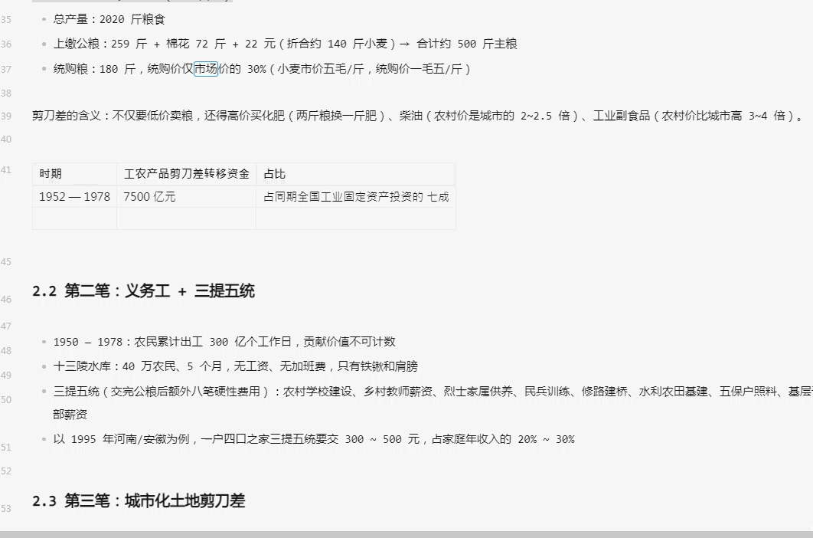
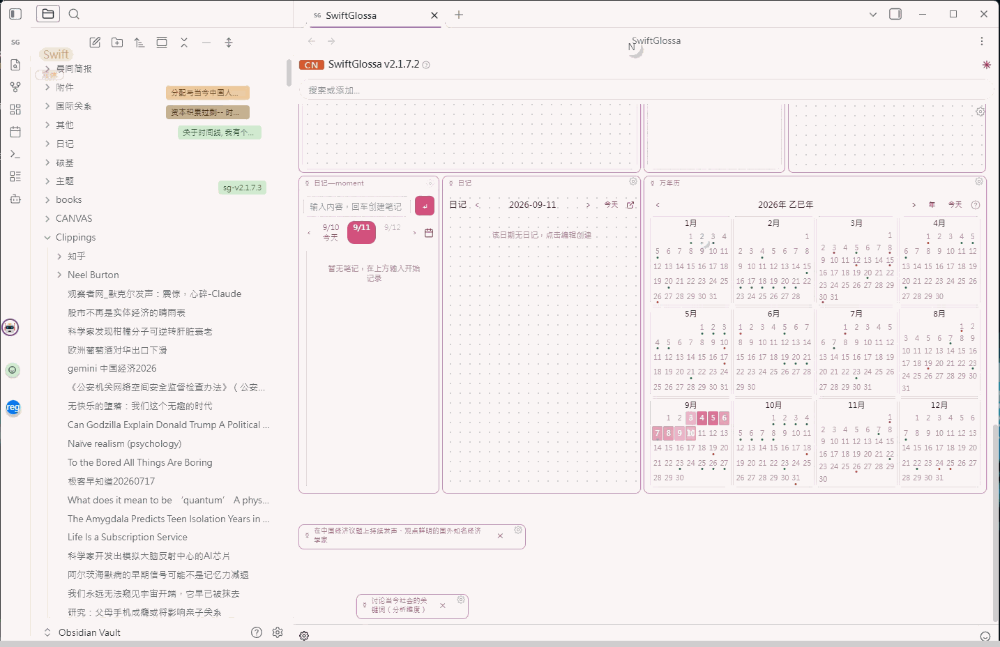
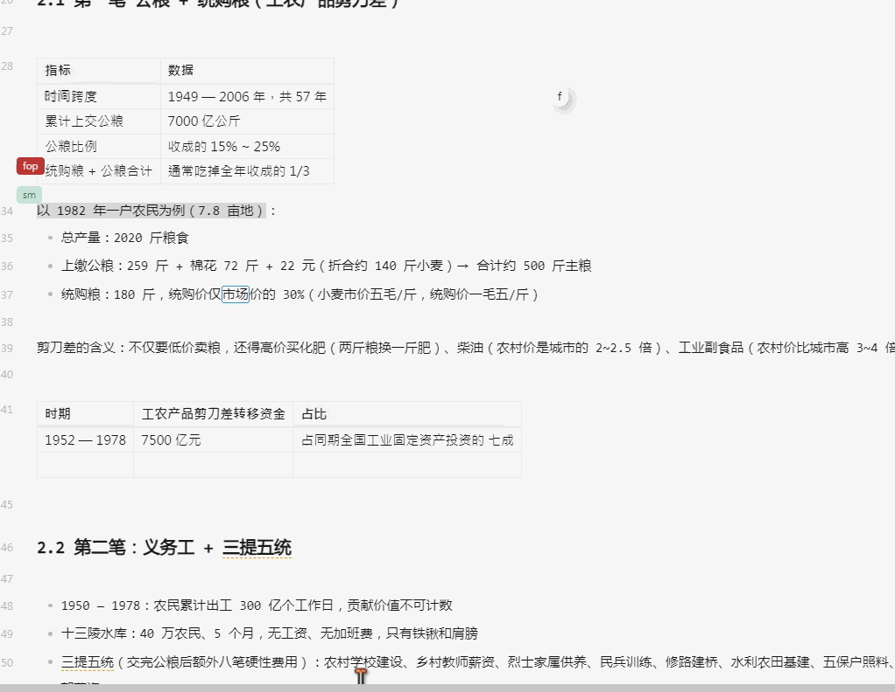

**义父/Patron daddy**:[莫问归期6666](https://b23.tv/TMXF3Jh)

# SwiftGlossa 

SwiftGlossa highlights keywords with regex + custom CSS and indexes them into a searchable highlight database — click any keyword to surface every match vault-wide. Keywords are the bones, CSS the skin, the database the flesh; floating notes are a paper wristband of always-visible questions. (Formerly Regex CSS Highlighter)/SwiftGlossa 用正则+自定义 CSS 高亮关键词并建立可搜索的高亮数据库——点击任意关键词即可浮现全库匹配。关键词是骨头，CSS 是皮肤，数据库是血肉；悬浮笔记是常显问题的纸带手环。（原 Regex CSS Highlighter）
## Keyword Popup / 关键词弹窗

## Floating Notes / 悬浮笔记

### 🎨 Style Highlighting / 样式高亮

Style Highlighting / 样式高亮

- Regex Matching + CSS Styles / 正则匹配 + CSS 样式 — Match text using regular expressions and apply custom CSS styles to matched content / 使用正则表达式匹配文本，为匹配内容应用自定义 CSS 样式
- Style Category Management / 样式分类管理 — Styles organized by groups, with support for adding, editing, and deleting / 样式按分组分类，支持添加、编辑、删除样式
- Instant Style Application / 样式即时生效 — Styles take effect immediately after adding/editing/deleting, no restart required / 添加/编辑/删除样式后无需重启，立即在笔记中生效
- Floating Style Buttons / 样式悬浮按钮 — Right-click a style button to create a draggable floating button with adjustable size and opacity / 右键样式按钮可创建可拖动的悬浮按钮，支持调整大小和透明度
- Style Button Context Menu / 样式按钮右键菜单 — Copy class name, copy full style, float display, and other quick actions / 复制类名、复制完整样式、悬浮显示等快捷操作

## Installation / 安装

Installation / 社区安装

Search for "Regex Css Highlighter" in Obsidian Settings → Community Plugins → Browse to install directly.
在 Obsidian 设置 → 社区插件 → 浏览 中搜索 "Regex Css Highlighter" 直接安装。

Manual Installation / 手动安装

1. Download `main.js` and `manifest.json` / 下载 `main.js`、`manifest.json`
2. Create a `Regex-Css-Highlighter` folder in your Obsidian vault's `.obsidian/plugins/` directory / 在 Obsidian 库的 `.obsidian/plugins/` 目录下创建 `Regex-Css-Highlighter` 文件夹
3. Place the downloaded files in that folder / 将下载的文件放入该文件夹
4. Enable "Regex Css Highlighter" in Obsidian Settings → Community Plugins / 在 Obsidian 设置 → 社区插件中启用 "Regex Css Highlighter"

## Credits / 致谢

- [GridStack.js](https://github.com/gridstack/gridstack.js) (MIT) — Drag-and-drop resizable card layout / 拖拽调整大小的卡片布局

## Sponsor / 赞助

If you find this plugin helpful, consider buying me a coffee! / 如果这个插件对你有帮助，请考虑支持我！

